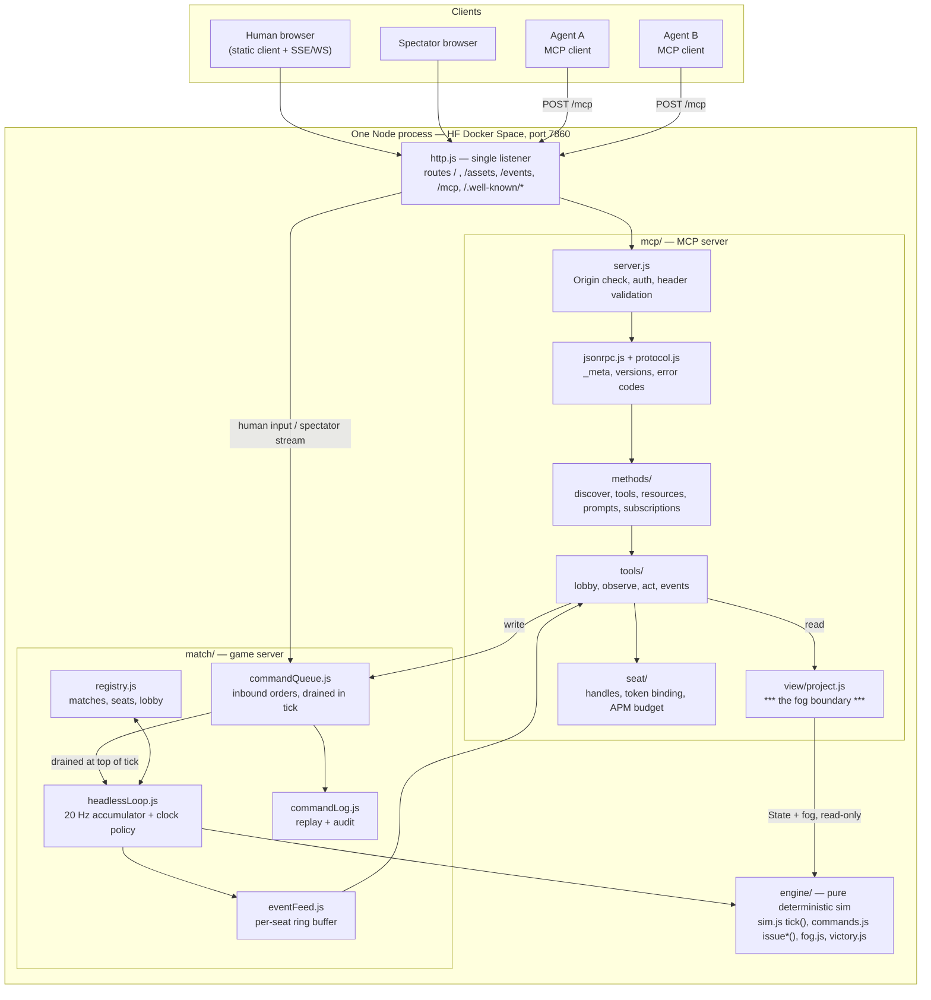

# 05 — MCP agent play: letting AI agents join SpaceCities matches as players

**Status:** analysis / recommendation. Input to `docs/PRD.md`, `docs/adr/`, `TASKS.md`.
**Date:** 2026-08-30.
**Scope:** the wire protocol, the real-time-vs-deliberation problem, the tool/resource/prompt
surface, fairness, module layout, and the test strategy for an MCP server that lets an LLM agent
occupy an ordinary player seat in a SpaceCities match.

---

## 0. Headline: the protocol is not what you think it is

> **Verify-first finding.** The task brief (and most MCP material written before mid-2026) assumes
> an `initialize`/`initialized` handshake, an `Mcp-Session-Id` header, a standalone `GET` SSE
> endpoint, and `Last-Event-ID` resumability. **All four were removed** in the current spec
> revision. Anything designed against them would be built against a superseded revision.

The current MCP protocol revision is **`2026-07-28`**, published **28 July 2026**, and it is
declared *Current* on the versioning page:

> "The **current** protocol version is [**2026-07-28**](/specification/2026-07-28/)."
> — <https://modelcontextprotocol.io/specification/versioning>

Revision history (all still reachable): `2026-07-28` (current), `2025-11-25`, `2025-06-18`,
`2025-03-26`, `2024-11-05`, plus `draft`
(<https://modelcontextprotocol.io/llms.txt>).

Normative sources used throughout this document:

| Topic | URL |
| --- | --- |
| Versioning / current revision | <https://modelcontextprotocol.io/specification/versioning> |
| Base protocol, `_meta`, error codes | <https://modelcontextprotocol.io/specification/2026-07-28/basic/index> |
| Versioning & compatibility | <https://modelcontextprotocol.io/specification/2026-07-28/basic/versioning> |
| Streamable HTTP transport | <https://modelcontextprotocol.io/specification/2026-07-28/basic/transports/streamable-http> |
| stdio transport | <https://modelcontextprotocol.io/specification/2026-07-28/basic/transports/stdio> |
| `server/discover` | <https://modelcontextprotocol.io/specification/2026-07-28/server/discover> |
| Tools | <https://modelcontextprotocol.io/specification/2026-07-28/server/tools> |
| Resources | <https://modelcontextprotocol.io/specification/2026-07-28/server/resources> |
| Prompts | <https://modelcontextprotocol.io/specification/2026-07-28/server/prompts> |
| Subscriptions (`subscriptions/listen`) | <https://modelcontextprotocol.io/specification/2026-07-28/basic/patterns/subscriptions> |
| Progress | <https://modelcontextprotocol.io/specification/2026-07-28/basic/patterns/progress> |
| Cancellation | <https://modelcontextprotocol.io/specification/2026-07-28/basic/patterns/cancellation> |
| Authorization | <https://modelcontextprotocol.io/specification/2026-07-28/basic/authorization/> |
| Changelog for this revision | <https://modelcontextprotocol.io/specification/2026-07-28/changelog> |
| Schema (source of truth) | <https://github.com/modelcontextprotocol/modelcontextprotocol/blob/main/schema/2026-07-28/schema.ts> |
| Release announcement | <https://blog.modelcontextprotocol.io/posts/2026-07-28/> |

The spec repository is **`modelcontextprotocol/modelcontextprotocol`**
(<https://github.com/modelcontextprotocol/modelcontextprotocol>); `schema/2026-07-28/schema.ts` is
the authoritative TypeScript schema, with a generated `schema.json` beside it.

**Verification stamp.** Every protocol claim in §1 was re-fetched from the live specification on
**2026-08-30** and checked against the page text rather than recalled — the versioning page,
Streamable HTTP transport, base protocol (`_meta`, error codes, statelessness), `server/discover`,
tools, resources, prompts, progress, cancellation, subscriptions, authorization, and the changelog.
The revision was still `2026-07-28`/Current at that moment. Two claims in this document are the ones
most worth re-checking before code is written, because they are the ones that would silently produce
a non-conforming server: (i) that `MCP-Protocol-Version`, `Mcp-Method` and `Mcp-Name` are *required*
headers with server-side header↔body validation, and (ii) that `ttlMs` and `cacheScope` are
*required* on every `*/list`, `resources/read` and `resources/templates/list` result
(`CacheableResult`). Both are recent additions that no pre-2026 MCP tutorial or SDK example will
show you.

### 0.1 Decisions at a glance

| # | Decision | Recommendation |
| --- | --- | --- |
| D1 | Protocol revision | Implement **`2026-07-28` only**. Do not implement the legacy `initialize` era. |
| D2 | Transport | **Streamable HTTP**, single `POST /mcp` endpoint on the Space's one public port. No stdio. |
| D3 | Statefulness | Server-minted opaque **seat handle** returned by `join_match`, passed as an ordinary tool argument on every later call (the spec's own "Stateful Tools" pattern). |
| D4 | Pacing | **Hybrid.** APM ceiling on every agent seat *always* (anti-abuse); clock policy per match: `realtime` (forced whenever a human is seated), `deliberation` (default for agent-only), `slowed` (spectated showcase). |
| D5 | Determinism | Commands never mutate state from the HTTP handler. They enter an **inbound command queue drained at a fixed point in `tick()`**. |
| D6 | Observation | Tiered and summarized: `get_situation` → `get_map_overview` → `list_entities` → `describe_entities`. Never a raw state dump. |
| D7 | Actions | One batched `issue_orders` workhorse + three specialised tools (`build_structure`, `set_production`, `research`) + `end_turn`. Group selectors, never one-unit-at-a-time. |
| D8 | Reactivity | `wait_for_event` as a long-running `tools/call` streaming `notifications/progress`. `subscriptions/listen` is *not* usable for game events. |
| D9 | Auth | **Pre-shared bearer seat token** per agent seat as the shipped default, wrapped in a spec-shaped `401` + `WWW-Authenticate` + RFC 9728 metadata document so a future OAuth 2.1 upgrade is a drop-in. |
| D10 | Fog | A single projection module `mcp/view/project.js` is the *only* code allowed to read raw `State` on a request path. Enforced by a static-integrity test. |
| D11 | Architecture | Same process, separate `mcp/` module, one HTTP listener shared with the game server. |
| D12 | Testing | Pure in-process request handler + golden JSON-RPC transcripts + a fog no-leak crawler + a deterministic scripted agent playing a full match to a golden outcome. |

---

## 1. Protocol research

### 1.1 What `2026-07-28` changed, and why it matters to us

From the changelog (<https://modelcontextprotocol.io/specification/2026-07-28/changelog>), the
major changes, each with its consequence for this project:

1. **Protocol-level sessions and `Mcp-Session-Id` removed** (SEP-2567). *Consequence:* a match seat
   cannot be implicit connection state. It must be an explicit handle. See §1.7.
2. **MCP is now stateless — the `initialize`/`notifications/initialized` handshake is gone**
   (SEP-2575). Every request carries `io.modelcontextprotocol/protocolVersion` and
   `io.modelcontextprotocol/clientCapabilities` in `_meta`. *Consequence:* our server is a pure
   request→response function, which is exactly what makes it cheap to test (§7).
3. **`server/discover` added and is mandatory** — "Servers **MUST** implement it."
4. **The HTTP `GET` endpoint and `resources/subscribe`/`resources/unsubscribe` are replaced by
   `subscriptions/listen`**, a long-lived POST-response stream carrying only four opt-in
   notification types. *Consequence:* there is **no spec-blessed channel for arbitrary
   server-pushed game events**. See §1.8 and D8.
5. **`ping`, `logging/setLevel`, and `notifications/roots/list_changed` removed.** Log level is
   per-request via `io.modelcontextprotocol/logLevel`.
6. **MRTR (Multi Round-Trip Requests)** replaces server-initiated requests: a server that needs
   client input returns `resultType: "input_required"` with `inputRequests`, and the client retries
   with `inputResponses`. *Consequence:* our server never needs it — it asks the agent nothing.
7. **All results carry a required `resultType`** (`"complete"` or `"input_required"`).
8. **SSE resumability removed** — no `Last-Event-ID`, no SSE event ids. "A broken response stream
   loses the in-flight request; clients **MUST** re-issue it as a new request with a new request
   ID." *Consequence:* `wait_for_event` must be idempotent and cursor-based (§3.6).
9. **New required HTTP headers** `Mcp-Method` and `Mcp-Name`, with server-side header↔body
   validation (SEP-2243).
10. **`ttlMs` and `cacheScope` are required** on `tools/list`, `prompts/list`, `resources/list`,
    `resources/read`, `resources/templates/list` results (SEP-2549).
11. **Error code range re-partitioned**: `-32020`..`-32099` reserved for the spec.
12. **Roots, Sampling and Logging are Deprecated** (SEP-2577) with a twelve-month window. We use
    none of them.

### 1.2 Transports: stdio vs Streamable HTTP

The spec defines exactly two standard transports
(<https://modelcontextprotocol.io/specification/2026-07-28/basic/transports/>): **stdio** (client
launches the server as a subprocess, newline-delimited JSON-RPC on stdin/stdout) and **Streamable
HTTP**. The 2024-11-05 **HTTP+SSE** transport is formally *Deprecated* under the feature-lifecycle
policy:

> "**Deprecated**: The HTTP+SSE transport from protocol version 2024-11-05 has been deprecated
> since protocol version `2025-03-26` … New implementations **SHOULD NOT** adopt it."

**Recommendation (D2): Streamable HTTP, and only Streamable HTTP.**

The reasoning is forced by the deployment. A Hugging Face Docker Space exposes **one** public HTTP
port — `7860` by default, overridable with `app_port` in the README YAML block
(<https://huggingface.co/docs/hub/spaces-sdks-docker>) — and remote agents connect over the public
internet to `https://<owner>-<space>.hf.space`. stdio requires the client to *launch the server as
a subprocess*, which is structurally impossible for a hosted multiplayer game: there is one
long-lived match server, not one process per agent. Streamable HTTP is also the transport whose
statelessness matches ours: many agents, many matches, one endpoint.

We do **not** implement backward compatibility with the legacy `initialize` era. A dual-era server
doubles the surface area (two session models, two error models, a GET stream, resumability) for a
protocol revision whose SDKs — TypeScript, Python, Go, C# — all shipped modern support on release
day (<https://blog.modelcontextprotocol.io/posts/2026-07-28/>). We instead follow the spec's
courtesy rule for legacy clients:

> "A server that supports only modern versions **SHOULD** name the protocol versions it supports in
> any error it returns to an `initialize` request, on any transport."

So a POST of `initialize` gets a `400` with an `UnsupportedProtocolVersionError` naming
`["2026-07-28"]` — an actionable diagnostic rather than a silent hang.

### 1.3 Exact Streamable HTTP semantics to implement

**Endpoint.** "The server **MUST** provide a single HTTP endpoint path (hereafter referred to as
the **MCP endpoint**) that supports POST." We use `POST /mcp`.

**Methods.**

| Method | Behaviour |
| --- | --- |
| `POST /mcp` | The only supported method. Body is a single JSON-RPC *request* or *notification*. |
| `GET /mcp` | `405 Method Not Allowed` — "A server that supports only this revision and receives such traffic from an older client **SHOULD** respond … HTTP GET or DELETE to the MCP endpoint: respond with `405 Method Not Allowed`." |
| `DELETE /mcp` | `405 Method Not Allowed` (same rule). |
| `OPTIONS /mcp` | CORS preflight — not specified by MCP, but required in practice for browser-hosted clients. |

**Request headers we must require and validate.**

| Header | Required for | Rule |
| --- | --- | --- |
| `Content-Type: application/json` | all POSTs | — |
| `Accept` | all POSTs | "The client **MUST** include an `Accept` header listing both `application/json` and `text/event-stream`." |
| `MCP-Protocol-Version` | all POSTs | "Every POST request to the MCP endpoint **MUST** include an `MCP-Protocol-Version` header." Its value "**MUST** match the `io.modelcontextprotocol/protocolVersion` field carried in the request body's `_meta`. If the values do not match, the server **MUST** reject the request with `400 Bad Request` and a `HeaderMismatch` JSON-RPC error." |
| `Mcp-Method` | all requests | Mirrors body `method`. "These headers are **REQUIRED** for compliance." |
| `Mcp-Name` | `tools/call`, `resources/read`, `prompts/get` | Mirrors `params.name` or `params.uri`. Non-ASCII-safe values use the sentinel `=?base64?…?=`; servers "**MUST** decode an encoded `Mcp-Name` … before comparing it to the corresponding request body value." |
| `Origin` | when present | "Servers **MUST** validate the `Origin` header on all incoming connections to prevent DNS rebinding attacks. If the `Origin` header is present and invalid, servers **MUST** respond with HTTP 403 Forbidden." |
| `Authorization: Bearer <token>` | our choice | §1.9. |
| `Mcp-Session-Id` | never | "An `Mcp-Session-Id` header on a request: ignore it, and do not mint or echo session IDs." |
| `Last-Event-ID` | never | "A `Last-Event-ID` header: ignore it; streams are not resumable." |

**Response headers.** `Content-Type` is either `application/json` or `text/event-stream`. On SSE:
"servers **SHOULD** include the `X-Accel-Buffering: no` header in the HTTP response" so a reverse
proxy (the Space's ingress is one) does not buffer events. This is not optional in practice for us
— without it `wait_for_event` and any progress stream silently stall.

**Status codes.**

| Code | When |
| --- | --- |
| `200` | Request answered with `application/json` or an SSE stream. |
| `202 Accepted`, no body | Body was a JSON-RPC *notification* the server accepted. |
| `400 Bad Request` | Header/body mismatch or missing required header (`-32020`); missing required `_meta` field (`-32602`); unsupported protocol version (`-32022`); missing required client capability (`-32021`). |
| `403 Forbidden` | Invalid `Origin`. Also OAuth `insufficient_scope`. |
| `404 Not Found` | **Unknown RPC method** — "If the server does not implement the requested RPC method, it **MUST** respond with `404 Not Found` and a JSON-RPC error with code `-32601`." (Note: an unknown *tool* name is a different case — see §1.6.) |
| `405 Method Not Allowed` | `GET`/`DELETE` on the MCP endpoint. |
| `401 Unauthorized` | Missing/invalid bearer token, with a `WWW-Authenticate` challenge (§1.9). |

**SSE framing.** Plain [Server-Sent Events](https://html.spec.whatwg.org/multipage/server-sent-events.html):
`data: <json>\n\n` per message. Event `id:` fields are pointless here (resumability was removed).
For long-lived streams the spec explicitly endorses keep-alive comments:

> "servers are encouraged to periodically emit an SSE comment line (a line beginning with a colon,
> e.g. `:\r\n`) as a keep-alive."

Our rule: emit `:\r\n` every 15 s on any stream held open longer than that.

**Response-stream rules.** On a request POST the server chooses per request between a single JSON
object and an SSE stream. On an SSE stream the server **MAY** send `notifications/progress` and
`notifications/message` that "**MUST** relate to the originating client request", **MUST NOT** send
independent JSON-RPC *requests*, and the final response "**SHOULD** terminate the stream."

**Session lifecycle.** There is none. This is the single biggest departure from older material.
Everything that must persist across calls is an explicit handle (§1.7).

**Resumability.** "Resumable SSE streams via `Last-Event-ID` are not supported."

**Cancellation.** "Closing the SSE response stream **MUST** be treated by the server as cancellation
of that request … The server **SHOULD** stop work on the cancelled request as soon as practical and
**MUST NOT** send any further messages for it."
(<https://modelcontextprotocol.io/specification/2026-07-28/basic/patterns/cancellation>). On
Streamable HTTP "no `notifications/cancelled` message is required or expected." In Node that is a
`res.on('close')` handler; every long-running tool must register one.

### 1.4 The JSON-RPC message shapes, concretely

All messages are JSON-RPC 2.0, UTF-8. Requests carry a non-null string/number `id`; results carry
a **required `resultType`**; notifications carry no `id`.

#### `server/discover` (mandatory)

Request — note the mirrored headers and the `_meta` block:

```http
POST /mcp HTTP/1.1
Host: alma-spacecities.hf.space
Content-Type: application/json
Accept: application/json, text/event-stream
MCP-Protocol-Version: 2026-07-28
Mcp-Method: server/discover
Authorization: Bearer sc_seat_9f3a…

{
  "jsonrpc": "2.0",
  "id": "d1",
  "method": "server/discover",
  "params": {
    "_meta": {
      "io.modelcontextprotocol/protocolVersion": "2026-07-28",
      "io.modelcontextprotocol/clientInfo": { "name": "ExampleAgent", "version": "0.4.1" },
      "io.modelcontextprotocol/clientCapabilities": {}
    }
  }
}
```

Response:

```json
{
  "jsonrpc": "2.0",
  "id": "d1",
  "result": {
    "resultType": "complete",
    "supportedVersions": ["2026-07-28"],
    "capabilities": {
      "tools": { "listChanged": false },
      "resources": { "listChanged": false, "subscribe": false },
      "prompts": { "listChanged": false }
    },
    "instructions": "SpaceCities is a real-time strategy game. You occupy one player seat in a live match. Call join_match to take a seat, then loop: get_situation -> (get_map_overview | list_entities | get_tech_options) -> issue_orders -> end_turn or wait_for_event. Read the resources spacecities://rules/*, spacecities://units, spacecities://buildings and spacecities://counters once at the start of a match; they never change during a match. You cannot see through fog of war and you cannot command another seat's units.",
    "ttlMs": 3600000,
    "cacheScope": "public",
    "_meta": {
      "io.modelcontextprotocol/serverInfo": { "name": "spacecities-mcp", "version": "1.0.0" }
    }
  }
}
```

`instructions` is the highest-leverage field in the whole protocol for this project: it is the one
place the server gets to tell every agent how to play before it has read a single tool schema.

#### `tools/list`

```json
{ "jsonrpc": "2.0", "id": 2, "method": "tools/list",
  "params": { "_meta": { "io.modelcontextprotocol/protocolVersion": "2026-07-28",
                         "io.modelcontextprotocol/clientCapabilities": {} } } }
```

```json
{ "jsonrpc": "2.0", "id": 2,
  "result": {
    "resultType": "complete",
    "tools": [ /* §3 */ ],
    "ttlMs": 3600000,
    "cacheScope": "public",
    "_meta": { "io.modelcontextprotocol/serverInfo": { "name": "spacecities-mcp", "version": "1.0.0" } }
  } }
```

`ttlMs`/`cacheScope` are required by `CacheableResult`. Our tool list is a compile-time constant,
so a long TTL and `"public"` are correct and let clients skip the round trip. The spec also says
servers "**SHOULD** return tools in a deterministic order"; ours is a frozen array literal, which
satisfies that by construction and is worth a test.

#### `tools/call`

```http
POST /mcp HTTP/1.1
Content-Type: application/json
Accept: application/json, text/event-stream
MCP-Protocol-Version: 2026-07-28
Mcp-Method: tools/call
Mcp-Name: issue_orders
Authorization: Bearer sc_seat_9f3a…

{
  "jsonrpc": "2.0",
  "id": 17,
  "method": "tools/call",
  "params": {
    "name": "issue_orders",
    "arguments": {
      "seat": "seat_01JB3QY7K8ZC4W2N",
      "orders": [
        { "order": "attack_move", "units": { "group": "army" }, "x": 2180, "y": 640, "formation": "wedge" },
        { "order": "gather", "units": { "filter": { "type": "worker", "idle": true } }, "node_id": "n_41" }
      ]
    },
    "_meta": {
      "io.modelcontextprotocol/protocolVersion": "2026-07-28",
      "io.modelcontextprotocol/clientInfo": { "name": "ExampleAgent", "version": "0.4.1" },
      "io.modelcontextprotocol/clientCapabilities": {}
    }
  }
}
```

Result (single JSON object; no stream needed for a fast tool):

```json
{
  "jsonrpc": "2.0",
  "id": 17,
  "result": {
    "resultType": "complete",
    "content": [{ "type": "text", "text": "2/2 orders accepted. 14 units moved, 3 workers sent to n_41. APM budget: 2 spent, 2.1 remaining." }],
    "structuredContent": {
      "applied_at_tick": 4820,
      "results": [
        { "index": 0, "accepted": true, "units_affected": 14 },
        { "index": 1, "accepted": true, "units_affected": 3 }
      ],
      "budget": { "spent": 2, "remaining": 2.1, "apm": 60 }
    },
    "isError": false,
    "_meta": { "io.modelcontextprotocol/serverInfo": { "name": "spacecities-mcp", "version": "1.0.0" } }
  }
}
```

#### `resources/list` and `resources/read`

```json
{ "jsonrpc": "2.0", "id": 5, "method": "resources/read",
  "params": { "uri": "spacecities://counters",
              "_meta": { "io.modelcontextprotocol/protocolVersion": "2026-07-28",
                         "io.modelcontextprotocol/clientCapabilities": {} } } }
```

```json
{ "jsonrpc": "2.0", "id": 5,
  "result": {
    "resultType": "complete",
    "contents": [{ "uri": "spacecities://counters", "mimeType": "text/markdown",
                   "text": "# Counter table\n\n| Attacker | Beats | Loses to |\n…" }],
    "ttlMs": 86400000,
    "cacheScope": "public"
  } }
```

Note the error-code change: a missing resource is now `-32602` (Invalid Params), not `-32002`.
"Servers **MUST NOT** return an empty `contents` array for a non-existent resource."

#### `prompts/get`

```json
{ "jsonrpc": "2.0", "id": 6, "method": "prompts/get",
  "params": { "name": "opening_build_order",
              "arguments": { "world": "ferros", "opponent_style": "unknown" },
              "_meta": { "io.modelcontextprotocol/protocolVersion": "2026-07-28",
                         "io.modelcontextprotocol/clientCapabilities": {} } } }
```

```json
{ "jsonrpc": "2.0", "id": 6,
  "result": {
    "resultType": "complete",
    "description": "A safe, tested opening for Ferros",
    "messages": [
      { "role": "user", "content": { "type": "text", "text": "You are playing SpaceCities on Ferros…" } },
      { "role": "user", "content": { "type": "resource",
          "resource": { "uri": "spacecities://units", "mimeType": "text/markdown", "text": "…" } } }
    ]
  } }
```

#### `notifications/progress` (on the response stream of a long-running call)

The client opts in by putting a `progressToken` in the request's `_meta`
(<https://modelcontextprotocol.io/specification/2026-07-28/basic/patterns/progress>):

```json
{ "jsonrpc": "2.0", "id": 31, "method": "tools/call",
  "params": { "name": "wait_for_event",
              "arguments": { "seat": "seat_01JB3QY7K8ZC4W2N", "timeout_s": 45, "since_cursor": 812 },
              "_meta": { "progressToken": "wfe-31",
                         "io.modelcontextprotocol/protocolVersion": "2026-07-28",
                         "io.modelcontextprotocol/clientCapabilities": {} } } }
```

Over the SSE stream:

```
HTTP/1.1 200 OK
Content-Type: text/event-stream
Cache-Control: no-cache
X-Accel-Buffering: no

data: {"jsonrpc":"2.0","method":"notifications/progress","params":{"progressToken":"wfe-31","progress":5,"total":45,"message":"t=241s — quiet; 3 workers idle"}}

:

data: {"jsonrpc":"2.0","method":"notifications/progress","params":{"progressToken":"wfe-31","progress":12,"total":45,"message":"t=248s — contact: 4 enemy units near your east expansion"}}

data: {"jsonrpc":"2.0","id":31,"result":{"resultType":"complete","content":[{"type":"text","text":"attack_on_base at t=248.4s: 4 enemy units (2 skiff, 2 lancer) engaging command_2 at (2410,880). Your CC is at 91% hp."}],"structuredContent":{"cursor":827,"events":[…]},"isError":false}}

```

Rules that bind us: "`progress` value **MUST** increase with each notification"; notifications
"**MUST** stop after completion"; "Both parties **SHOULD** implement rate limiting to prevent
flooding." We cap progress notifications at one per 3 s per stream.

#### Error responses

Unsupported version — note this is `400 Bad Request` at the HTTP layer:

```json
{ "jsonrpc": "2.0", "id": 1,
  "error": { "code": -32022, "message": "Unsupported protocol version",
             "data": { "supported": ["2026-07-28"], "requested": "2025-06-18" } } }
```

Header mismatch:

```json
{ "jsonrpc": "2.0", "id": 1,
  "error": { "code": -32020,
             "message": "Header mismatch: Mcp-Name header value 'get_situation' does not match body value 'issue_orders'" } }
```

### 1.5 `_meta` — the per-request protocol envelope

Every client request carries these in `params._meta`
(<https://modelcontextprotocol.io/specification/2026-07-28/basic/index#meta>):

| Key | Type | Required | Notes |
| --- | --- | --- | --- |
| `io.modelcontextprotocol/protocolVersion` | string | **Yes** | Must equal the `MCP-Protocol-Version` header. |
| `io.modelcontextprotocol/clientCapabilities` | object | **Yes** | "A server **MUST NOT** rely on capabilities the client has not declared." |
| `io.modelcontextprotocol/clientInfo` | object | No | Clients **SHOULD** send it. |
| `io.modelcontextprotocol/logLevel` | string | No | Logging is Deprecated; we ignore it. |
| `progressToken` | string\|integer | No | Opts into progress notifications. |

"A request missing any required field is malformed; the server **MUST** reject it with JSON-RPC
error code `-32602` (Invalid params). On HTTP, the response status **MUST** be `400 Bad Request`."

Results **SHOULD** carry `io.modelcontextprotocol/serverInfo` in `_meta`.

Crucially: `clientInfo` and `serverInfo` "are self-reported … and are not verified by the protocol
… **SHOULD NOT** rely on them for security decisions." **We must not identify an agent seat by
`clientInfo`.** Seat identity comes from the bearer token alone (§5).

### 1.6 Error codes

| Code | Name | Our use |
| --- | --- | --- |
| `-32700` | Parse error | Malformed JSON body. |
| `-32600` | Invalid Request | Not a JSON-RPC 2.0 message; body is a *response* (clients "**MUST NOT** send JSON-RPC responses"). |
| `-32601` | Method not found | Unknown RPC method — HTTP **404**. |
| `-32602` | Invalid params | Missing `_meta` field (HTTP 400); unknown tool name; unknown prompt; **unknown resource URI**; missing required prompt argument. |
| `-32603` | Internal error | Bug in the server. Never used for game-rule rejections. |
| `-32020` | `HeaderMismatch` | Header↔body mismatch or missing required header. HTTP 400. |
| `-32021` | `MissingRequiredClientCapability` | Unused — we require no client capability. |
| `-32022` | `UnsupportedProtocolVersion` | Version not in `["2026-07-28"]`. HTTP 400. |

Allocation policy: "`-32020` to `-32099` — reserved for the MCP specification. Implementations
**MUST NOT** emit any code from this sub-range that is not defined by this specification", and new
application codes "**SHOULD** be allocated outside the JSON-RPC reserved range (`-32768` to
`-32000`)". **We allocate no custom JSON-RPC codes at all.**

That is a deliberate design rule, and it drives §3: *every game-rule rejection is a tool execution
error, not a protocol error.* The spec draws the line for us:

> "**Protocol Errors** indicate issues with the request structure itself that models are less
> likely to be able to fix … **Tool Execution Errors** contain actionable feedback that language
> models can use to self-correct and retry with adjusted parameters … reported in tool results with
> `isError: true`."

"Cannot afford a Barracks (need 150 ore, have 90)" is *exactly* the self-correctable case. It
returns `isError: true` with a plain-English reason and a machine-readable `structuredContent`,
HTTP 200. "Unknown tool `attak_move`" is `-32602`.

### 1.7 Statelessness and the seat handle

> "MCP has no protocol-level session, so a server cannot rely on implicit per-connection state to
> relate one tool call to the next. Servers that need to maintain state across calls … should do so
> by returning an explicit handle from a creation tool and accepting that handle as an argument on
> subsequent calls."
> — <https://modelcontextprotocol.io/specification/2026-07-28/server/tools#stateful-tools>

A match seat is the textbook case. `join_match` mints `seat_01JB3QY7K8ZC4W2N`; every later tool
call takes `seat` as its first argument. The spec's four design notes map onto our requirements
cleanly:

- **Authorization** — "For authenticated servers, a handle is a name, not a capability. The server
  should validate the caller's authorization against the handle on every call." We are
  authenticated (bearer token), so the seat id is a *name*: on every call we check
  `seats.get(seat).tokenId === request.tokenId`. Stealing another agent's seat id gets you nothing.
- **Opacity** — ULID-ish opaque string, no encoded match index or player number.
- **Lifetime** — stated in the `join_match` description: "a seat is released 120 s after your last
  call, or when the match ends."
- **Expiry errors** — an expired/unknown seat returns `isError: true` with `"seat expired; call
  list_matches and join_match again"`, so the model recovers instead of looping.

Note also the list-endpoint rule: `tools/list`, `resources/list` and `prompts/list` "**MUST NOT**
vary per-connection or as a side effect of other requests on the connection", though the set
"**MAY** vary by the authorization presented on the request." So the tool list must be identical
for a seated and unseated agent — we cannot hide `issue_orders` until you have joined. That is fine:
calling it without a valid seat is a tool execution error.

### 1.8 Long-running operations, notifications, and the real-time problem

The RTS runs while the agent thinks, so we need server→client push. The protocol offers three
mechanisms, and only one of them fits:

1. **`notifications/progress` on a request's own response stream.** Server-to-client, arbitrary
   `message` string, arbitrary cadence, cancellable by closing the stream. ✅ **This is our
   mechanism.**
2. **`subscriptions/listen`.** A long-lived POST-response stream — but its filter is a closed set:
   `toolsListChanged`, `promptsListChanged`, `resourcesListChanged`, `resourceSubscriptions`. And
   "The server **MUST NOT** send notification types the client has not explicitly requested."
   There is no way to push a game event down it. ❌ **Not usable for gameplay.**
3. **MRTR (`resultType: "input_required"`).** For the *server* to ask the *client* for input. We
   never need to. ❌

There is a legal indirect route: model the seat's event feed as a *resource*
(`spacecities://match/{id}/seat/{seat}/events`), declare `resources.subscribe: true`, and push
`notifications/resources/updated` on a `subscriptions/listen` stream; the agent then calls
`resources/read`. That is two round-trips per event and requires client support for
`subscriptions/listen`, which not every client has. **Recommendation: implement `wait_for_event` as
the primary path (D8), and treat the resource-subscription route as an optional later addition.**

Timeouts and cancellation bind our implementation:

- Clients "**SHOULD** establish timeouts for all sent requests." A `wait_for_event` that blocks for
  15 minutes will be killed by the client. We cap `timeout_s` at **120** and default to **45**, and
  we emit progress every ≤3 s so that clients which "reset the timeout clock when receiving a
  progress notification" keep the stream alive.
- Stream close = cancellation, and after it the server "**MUST NOT** send any further messages for
  it." So the waiter registry is keyed on the response object and torn down in `res.on('close')`.
- No resumability: if the stream breaks, the agent re-issues with a **new request id**. Therefore
  `wait_for_event` takes `since_cursor` and returns `cursor` — the event feed is a durable,
  seat-scoped ring buffer, not a transient subscription. A dropped connection loses nothing.

### 1.9 Authorization

**What the spec requires.** Authorization is *optional*, but "Implementations using an HTTP-based
transport **SHOULD** conform to this specification"
(<https://modelcontextprotocol.io/specification/2026-07-28/basic/authorization/>). Conforming means:

- The MCP server acts as an **OAuth 2.1 resource server**; the client is an OAuth 2.1 client.
- "MCP servers **MUST** implement OAuth 2.0 Protected Resource Metadata
  ([RFC9728](https://datatracker.ietf.org/doc/html/rfc9728))" and clients **MUST** use it for
  authorization-server discovery.
- Bearer tokens in the `Authorization: Bearer <access-token>` header, "included in every HTTP
  request from client to server"; "Access tokens **MUST NOT** be included in the URI query string."
- "MCP servers … **MUST** validate that access tokens were issued specifically for them as the
  intended audience, according to RFC 8707 §2 … Invalid or expired tokens **MUST** receive a HTTP
  401 response." "MCP servers **MUST NOT** accept or transit any other tokens."
- Clients **MUST** implement RFC 8707 `resource` indicators; authorization servers **MUST**
  implement OAuth 2.1 with PKCE and **MUST** offer RFC 8414 or OIDC Discovery metadata.
- Client registration is now via **Client ID Metadata Documents** (SHOULD), with RFC 7591 Dynamic
  Client Registration **deprecated** but retained.
- Errors: `401` (auth required/invalid token), `403` (invalid scopes / insufficient permissions),
  `400` (malformed). A `401` carries
  `WWW-Authenticate: Bearer resource_metadata="…", scope="…"`.

The spec also explicitly leaves the door open: "clients and servers **MAY** negotiate their own
custom authentication and authorization strategies."

**Recommendation (D9): pre-shared bearer seat tokens, in a spec-shaped wrapper.**

Running an OAuth 2.1 authorization server with PKCE, metadata discovery, Client ID Metadata
Documents and RFC 9207 issuer validation is several thousand lines of security-critical code. Under
a hard zero-npm constraint, hand-rolling it is the *least* safe option available, and it buys us
nothing: an agent seat is not a user's Google Drive, it is a slot in a game.

So: **the token is a capability, minted by the match owner, scoped to one seat in one match.**

```
POST /mcp
Authorization: Bearer sc_v1_<32 random bytes, base64url>
```

Concretely:

- Generated with `crypto.randomBytes(32)`, prefixed `sc_v1_`, stored as a SHA-256 hash, compared
  with `crypto.timingSafeEqual`. (`node:crypto` is stdlib — no dependency.)
- Bound at mint time to `{matchId, seatSlot, label, expiresAt}`. A token cannot join a different
  match or a second seat. Single-use for `join_match`; reusable for the seat's lifetime thereafter.
- Lifetime = match length + 10 minutes, hard-capped at 4 hours. Revoked when the match ends.
- Handed out by the human match creator through the ordinary web UI ("Invite an agent" → copy
  token + endpoint URL), or by an admin-token-gated `POST /admin/seats` for a ladder harness.
- Never logged, never echoed in a tool result, never accepted from a query string.

We still return the spec-shaped challenge, so any conforming MCP client fails informatively and a
future OAuth upgrade is a drop-in:

```http
HTTP/1.1 401 Unauthorized
WWW-Authenticate: Bearer realm="spacecities",
                  resource_metadata="https://alma-spacecities.hf.space/.well-known/oauth-protected-resource",
                  scope="match:play"
Content-Type: application/json

{"jsonrpc":"2.0","id":null,"error":{"code":-32603,"message":"Authorization required. Obtain a seat token from the match owner."}}
```

and we serve a minimal RFC 9728 document at
`/.well-known/oauth-protected-resource` naming `resource`, `scopes_supported: ["match:play",
"match:spectate"]` and — honestly — an empty `authorization_servers` array, since we have none.
**Flagged deviation:** an empty `authorization_servers` is not a conforming resource-server
configuration; a strict OAuth-only client will not be able to complete discovery. This is the one
place we knowingly diverge from the SHOULD, and it should be recorded in the ADR with the
"custom authentication strategies" clause as the justification.

Also required regardless of scheme: **`Origin` validation.** The Space is a public origin, and MCP
agents are not browsers, so the rule is: if `Origin` is present it must be in an allowlist
(`https://<space>.hf.space` and configured dev origins), otherwise `403`. Absent `Origin`
(non-browser client) is allowed, because the bearer token is doing the real work.

---

## 2. The central design problem: real time vs turn taking

### 2.1 Framing the numbers

- The sim is a fixed 20 Hz accumulator loop (`engine/loop.js`, `hz = 20`, `MAX_SUBSTEPS = 5`).
- A match runs to `DEFAULT_MATCH_TIME_LIMIT = 2400` sim-seconds (40 min), or until one side loses
  its last Command Center (`engine/victory.js`).
- The scripted AI is already rate-limited by an APM dial: `DIFFICULTY_OPTIONS` in
  `engine/aiDifficulty.js` gives Easy `aiApm: 20`, Medium `65`, Hard `140`, and the splash screen
  exposes the full 1–150 range. The mechanism is in `engine/aiCommon.js`:
  `accrueActionBudget` adds `(apm / 60) * dt` credits per tick, clamped to
  `Math.max(2, apm * APM_BURST_FRAC)` with `APM_BURST_FRAC = 1/15` (≈4 seconds of banked actions);
  `canAct` checks `budget >= 1`; `spend` decrements by 1.
- An LLM agent's decision latency is **2–20 s** per turn including tool round-trips. In 10 s the
  sim advances **200 ticks**. A Skiff (speed 90) crosses 900 world units; a Barracks (buildTime 20)
  is half-built; a raid on an undefended expansion is over.

So the honest statement of the problem: **an LLM agent's action rate is 3–20 APM, against a human's
30–200 and the scripted Hard AI's 140.** The gap is an order of magnitude, and no amount of tool
design closes it. Only the clock can.

### 2.2 The options

**(a) Pure real time — the agent is just slow.**
*For:* zero engine change, perfectly fair by construction, great spectator experience, matches
finish in bounded wall-clock time.
*Against:* the agent loses to any competent human, badly and boringly. Worse for us, it is
**non-reproducible**: the outcome depends on model latency and network jitter, so no agent match can
ever be a regression test. It also produces a specific pathology — the agent decides on a snapshot
that is already 5–15 seconds stale, so it repeatedly issues orders against a world that has moved.
That reads as incompetence rather than as slowness.

**(b) An APM budget per agent seat.**
This is the option the brief frames as an alternative, and it is worth being blunt: **an APM budget
is a ceiling, not a floor.** It stops a scripted harness wrapping the LLM from issuing 10,000
commands per second; it does absolutely nothing for an agent that manages three commands a minute.
It is *necessary* — without it an agent seat is a cheat vector — but it solves a different problem
than the one asked about. It is orthogonal to (a)/(c)/(d), not an alternative to them.

**(c) The server pauses/steps the match while the agent thinks (turn gating).**
*For:* the agent plays at full effectiveness; the match becomes a **pure function of (seed, ordered
command list)** and is therefore replayable and testable; CPU cost collapses (a gated match burns no
ticks while the agent thinks, which matters a lot on 2 vCPU).
*Against:* completely unplayable for a human sharing the match; spectators see a stuttering,
stop-motion game; a hung agent stalls the match unless there is a watchdog; wall-clock match
duration becomes unbounded and unpredictable.

**(d) Hybrid.**
Different clock policies for different match kinds.

### 2.3 Recommendation

> **Recommend (d), implemented as a per-match `clock` policy, with (b)'s APM ceiling applied in
> every mode as an anti-abuse control rather than a pacing one.**

Three clock policies, selected at match creation and immutable thereafter:

| Policy | When | Behaviour |
| --- | --- | --- |
| **`realtime`** | **Forced** whenever any seat is human. | Sim runs at 20 Hz continuously. Agent seats get an APM ceiling (default 60, i.e. between Medium's 65 and a casual human). The agent is slow; that is honest and it is the price of playing with people. |
| **`deliberation`** | **Default** for agent-only and agent-vs-scripted-AI matches. | The sim advances in fixed steps of `deliberation_ticks` (default **20 ticks = 1 sim second**) and then blocks until every agent seat is *ready*. A seat becomes not-ready when it reads an observation and ready again when it calls `end_turn` (or `issue_orders` with `end_turn: true`), or when its **wall-clock watchdog** (default 20 s, max 120 s) fires. |
| **`slowed`** | Spectated showcase / exhibition matches. | Continuous clock at a time dilation factor (default **0.25×**, i.e. 5 effective ticks of sim per real second). Never blocks, so spectators see smooth motion; the agent gets 4× the thinking time per sim-second. APM ceiling still applies. |

**Why `deliberation` is the default for agent matches, decisively:**

1. **It is the only policy that makes agent play testable.** The project is strict TDD. A real-time
   agent match cannot be a test — its result depends on wall-clock latency. A deliberation match is
   a deterministic function of `(seed, [(turn, orders)…])`, exactly like the existing skirmish
   integration test in the source repo. §7 leans entirely on this.
2. **It is the cheapest policy on HF Spaces.** CPU Basic gives **2 vCPU and 16 GB RAM**
   (<https://huggingface.co/docs/hub/spaces-overview>), and free hardware sleeps when idle. A
   `realtime` match burns 20 ticks/second for 40 minutes whether or not anyone is thinking; a
   `deliberation` match burns ticks only in bursts between decisions and is idle (sleeping the
   Space, even) the rest of the time. On 2 vCPU we can host perhaps 4–8 concurrent realtime matches
   but dozens of gated ones.
3. **It makes agent-vs-agent evaluation meaningful.** Comparing two models on wall-clock-limited
   real-time play measures inference latency more than strategy. Gated play measures strategy.
4. **It preserves the spectator story where it matters.** Humans watch human matches (realtime) and
   showcase matches (slowed). Ladder/eval matches are run for the leaderboard, not the audience,
   and can be *replayed* afterwards at any speed from the recorded command list — the replay looks
   like a normal real-time match because it is one.

**Fairness rules that follow:**

- A match's clock policy is fixed at creation and **displayed on the lobby listing, the spectator
  view, and the result record**. A `deliberation` win is never presented as equivalent to a
  `realtime` win. Ladder ratings are kept in separate pools per policy.
- **`realtime` is forced for any match containing a human seat.** There is no "the human agrees to
  be paused" option; it produces a bad game and an unfalsifiable result.
- Agent APM ceiling is configurable per seat within the engine's own **1–150** range and defaults to
  **60**, so an agent seat is directly comparable to Easy/Medium/Hard. It uses the *same accrual
  constants* as `engine/aiCommon.js` (`APM_BURST_FRAC = 1/15`, `(apm/60)*dt` accrual,
  `Math.max(2, apm * APM_BURST_FRAC)` cap), and a guard test asserts the two agree (§7).
- In `deliberation` mode the APM ceiling is expressed **per turn** rather than per minute: a turn
  advances `deliberation_ticks / 20` sim-seconds, so the turn's action allowance is
  `apm/60 × deliberation_ticks/20`, banked with the same burst cap. At the default 20 ticks and 60
  APM that is 1 action per turn with up to 4 banked — which is *tight*, and deliberately so:
  otherwise a gated agent gets both unlimited thinking time and unlimited actions.

**The watchdog is not optional.** A crashed or rate-limited agent must not freeze a match. On
watchdog expiry the seat is marked ready with no orders (a "pass"), an event is written to the
seat's feed and the spectator log, and after **three consecutive passes** the seat is dropped and
handed to the scripted AI (`createAiController`) so the match still resolves. This mirrors the
engine's own philosophy — `engine/aiCommon.js` exempts the attack commit from the APM budget
precisely "so the game still always resolves."

### 2.4 Determinism: where commands are applied

This is a correctness point that the clock design forces and that is easy to get wrong.

`engine/sim.js`'s `tick(state, dt)` builds a per-tick spatial index, freezes miner/logistics/mender
counts "before any worker mines so every miner on a node sees the same count regardless of Map
iteration order (determinism)", and then iterates entities. **An HTTP handler calling
`issueMove(...)` directly would mutate `state` at an arbitrary point inside that iteration**, which
destroys replayability and can produce order-dependent behaviour.

> **D5 (rule):** MCP tool handlers never mutate `State`. They validate, then append to a per-match
> **inbound command queue**. The headless loop drains the queue in seat order at a fixed point at
> the top of `tick()`, before `runAI`. Every drained command is appended to the match's **command
> log** with `(tick, seat, order)`.

This single rule buys: replay, the golden-outcome integration test (§7), the anti-cheat audit trail
(§5), and a clean answer to "what tick did my order take effect on?" (`applied_at_tick` in every
`issue_orders` result).

---

## 3. Tool surface

### 3.1 The observation problem

A mid-game SpaceCities state on a Large map holds low hundreds of units, dozens of buildings, dozens
of resource nodes, a 40 px fog grid (`FOG_CELL_SIZE = 40` — on a 1600×1000 Small map that is already
40×25 = 1000 cells), plus orders, queues, veterancy and research state. A raw JSON dump is tens of
thousands of tokens, and it is *worse than useless*: the agent spends its whole context reading
coordinates and has none left to think with.

The design principle is **progressive disclosure with aggressive defaults**:

> Every observation tool answers a *question*, at a resolution chosen by the server, with a hard
> output budget. The agent drills down only where it has a reason to.

Four levels:

| Level | Tool | Typical size | Answers |
| --- | --- | --- | --- |
| L0 | `get_situation` | ~500–900 tokens | "How am I doing and what is happening?" |
| L1 | `get_map_overview` | ~300–600 tokens | "Where is everything, roughly?" |
| L2 | `list_entities` | ≤ page cap | "Which of my/their things match this filter?" |
| L3 | `describe_entities` | ≤ 20 ids | "Exact state of these specific things." |

Plus two question-shaped tools that exist because the alternative is the agent guessing and
failing: `get_tech_options` and `find_build_location`. (Production options do not need a third: the
buildable set is small, fully determined by which structures the seat owns, and already reported in
`get_situation.production`, so `set_production` can reject an unavailable type with an actionable
error rather than requiring a lookup call first.)

**All observation is fog-filtered at a single choke point** (§5). All of it carries `as_of_tick` and
`sim_time_s` so the agent knows how stale its picture is.

### 3.2 Shared schema fragments

These `$defs` are shared by several tools. In the emitted `inputSchema` they are inlined per tool
(the spec permits `$defs`, and warns implementations to bound composition-keyword cost; inlining
keeps each schema shallow and self-contained for the model).

```json
{
  "$defs": {
    "Seat": {
      "type": "string",
      "description": "Your seat handle from join_match, e.g. 'seat_01JB3QY7K8ZC4W2N'. Required on every match tool.",
      "pattern": "^seat_[A-Za-z0-9]{16,32}$"
    },
    "UnitSelector": {
      "description": "Which of YOUR units to command. Never selects another seat's units. Exactly one of ids/group/filter.",
      "type": "object",
      "oneOf": [
        { "required": ["ids"] },
        { "required": ["group"] },
        { "required": ["filter"] }
      ],
      "properties": {
        "ids": {
          "type": "array", "minItems": 1, "maxItems": 200,
          "items": { "type": "string" },
          "description": "Explicit unit ids from list_entities."
        },
        "group": {
          "type": "string",
          "enum": ["army", "idle_workers", "all_workers", "scouts", "wounded", "everything"],
          "description": "A standing group. 'army' = every combat-role unit you own. 'wounded' = combat units under 50% hp."
        },
        "filter": {
          "type": "object", "additionalProperties": false,
          "properties": {
            "type": { "type": "array", "items": { "type": "string" }, "description": "Unit type ids, e.g. ['skiff','lancer']." },
            "role": { "type": "string", "enum": ["combat", "worker", "scout", "support"] },
            "idle": { "type": "boolean", "description": "Only units with no active order." },
            "near": {
              "type": "object", "additionalProperties": false,
              "required": ["x", "y", "radius"],
              "properties": {
                "x": { "type": "number" }, "y": { "type": "number" },
                "radius": { "type": "number", "minimum": 1, "maximum": 4000 }
              }
            },
            "hp_below_pct": { "type": "number", "minimum": 0, "maximum": 100 },
            "limit": { "type": "integer", "minimum": 1, "maximum": 200, "default": 200 }
          }
        }
      },
      "additionalProperties": false
    },
    "Point": {
      "type": "object", "additionalProperties": false,
      "required": ["x", "y"],
      "properties": {
        "x": { "type": "number", "minimum": 0, "description": "World X. Map bounds are in get_map_overview." },
        "y": { "type": "number", "minimum": 0, "description": "World Y." }
      }
    },
    "Formation": {
      "type": "string",
      "enum": ["none", "line", "wedge", "grid", "column"],
      "default": "none",
      "description": "Shape to hold while moving. Units are auto-ranked so short-ranged units lead."
    }
  }
}
```

### 3.3 Lobby tools

#### `list_matches`

```json
{
  "name": "list_matches",
  "title": "List matches",
  "description": "List matches you may join or spectate. Call this first. Shows the clock policy (realtime / deliberation / slowed), the world, open seats, and whether humans are playing. Does not require a seat.",
  "inputSchema": {
    "type": "object",
    "additionalProperties": false,
    "properties": {
      "state": {
        "type": "string",
        "enum": ["open", "running", "any"],
        "default": "open",
        "description": "'open' = has a free seat and has not started."
      },
      "limit": { "type": "integer", "minimum": 1, "maximum": 50, "default": 20 }
    }
  },
  "outputSchema": {
    "type": "object",
    "required": ["matches"],
    "properties": {
      "matches": {
        "type": "array",
        "items": {
          "type": "object",
          "required": ["match_id", "world", "state", "clock", "seats"],
          "properties": {
            "match_id": { "type": "string" },
            "world": { "type": "string", "description": "Planet id, e.g. 'ferros'." },
            "state": { "type": "string", "enum": ["lobby", "running", "finished"] },
            "clock": {
              "type": "object",
              "required": ["policy"],
              "properties": {
                "policy": { "type": "string", "enum": ["realtime", "deliberation", "slowed"] },
                "deliberation_ticks": { "type": "integer" },
                "turn_watchdog_s": { "type": "number" },
                "time_scale": { "type": "number" }
              }
            },
            "map_size": { "type": "string", "enum": ["small", "medium", "large", "huge", "gigantic"] },
            "match_time_limit_s": { "type": "number" },
            "sim_time_s": { "type": "number" },
            "seats": {
              "type": "array",
              "items": {
                "type": "object",
                "required": ["slot", "occupant"],
                "properties": {
                  "slot": { "type": "string", "description": "Seat slot id, e.g. 'p1'." },
                  "occupant": { "type": "string", "enum": ["open", "human", "agent", "scripted_ai"] },
                  "label": { "type": "string" },
                  "apm_cap": { "type": "integer" }
                }
              }
            }
          }
        }
      }
    }
  }
}
```

#### `join_match`

```json
{
  "name": "join_match",
  "title": "Join a match",
  "description": "Take a seat in a match and receive your seat handle. Your bearer token already determines which match and seat you may take, so in the common case you can call this with no arguments. Returns the seat handle you must pass to every other match tool, plus the opening situation. A seat is released 120 seconds after your last call, or when the match ends.",
  "inputSchema": {
    "type": "object",
    "additionalProperties": false,
    "properties": {
      "match_id": { "type": "string", "description": "Omit to join the match your token was minted for." },
      "seat_slot": { "type": "string", "description": "Omit to take the slot your token was minted for." },
      "label": { "type": "string", "maxLength": 40, "description": "Display name shown to spectators, e.g. 'Opus-5 aggro'." }
    }
  },
  "outputSchema": {
    "type": "object",
    "required": ["seat", "match_id", "seat_slot", "clock", "situation"],
    "properties": {
      "seat": { "type": "string" },
      "match_id": { "type": "string" },
      "seat_slot": { "type": "string" },
      "owner": { "type": "string", "description": "Your engine owner id — the value of 'owner' on your entities." },
      "apm_cap": { "type": "integer" },
      "clock": { "type": "object" },
      "starts_in_s": { "type": "number" },
      "situation": { "type": "object", "description": "Same shape as get_situation, so you can act immediately." }
    }
  }
}
```

#### `leave_match`

```json
{
  "name": "leave_match",
  "title": "Leave a match",
  "description": "Release your seat. In a running match your side is handed to the scripted AI so the match still resolves; this counts as a forfeit for rating purposes. Safe to call twice.",
  "inputSchema": {
    "type": "object",
    "additionalProperties": false,
    "required": ["seat"],
    "properties": {
      "seat": { "type": "string", "pattern": "^seat_[A-Za-z0-9]{16,32}$" },
      "reason": { "type": "string", "maxLength": 200 }
    }
  },
  "outputSchema": {
    "type": "object",
    "required": ["released"],
    "properties": {
      "released": { "type": "boolean" },
      "final_result": { "type": ["object", "null"] }
    }
  }
}
```

### 3.4 Observation tools

#### `get_situation` — the workhorse

This is the tool an agent calls at the top of every turn. It must be *complete enough to act on
alone* in the common case.

```json
{
  "name": "get_situation",
  "title": "Situation report",
  "description": "Your one-screen situation report: clock, economy, supply, army, production, research, bases, visible threats, and what changed since your last call. Fog of war applies — you see only what your units and buildings can currently see, plus terrain and charted deposits you have explored. Call this at the start of every turn. Prefer this over list_entities; drill down only when this raises a question.",
  "inputSchema": {
    "type": "object",
    "additionalProperties": false,
    "required": ["seat"],
    "properties": {
      "seat": { "type": "string", "pattern": "^seat_[A-Za-z0-9]{16,32}$" },
      "verbosity": {
        "type": "string",
        "enum": ["brief", "normal", "full"],
        "default": "normal",
        "description": "'brief' omits per-base and per-building detail; 'full' adds per-unit-type veterancy and per-node depletion."
      },
      "include_events_since_cursor": {
        "type": "integer",
        "minimum": 0,
        "description": "Include seat events after this cursor (from a previous get_situation or wait_for_event). Omit for the last 20 events."
      }
    }
  },
  "outputSchema": {
    "type": "object",
    "required": ["as_of_tick", "sim_time_s", "economy", "supply", "army", "threats"],
    "properties": {
      "as_of_tick": { "type": "integer" },
      "sim_time_s": { "type": "number" },
      "time_remaining_s": { "type": ["number", "null"], "description": "Until the match time limit settles it on score." },
      "turn": {
        "type": "object",
        "description": "Present only in deliberation mode.",
        "properties": {
          "number": { "type": "integer" },
          "your_turn": { "type": "boolean" },
          "deadline_in_s": { "type": "number" },
          "actions_available": { "type": "number" }
        }
      },
      "economy": {
        "type": "object",
        "properties": {
          "resources": {
            "type": "object",
            "properties": {
              "ore": { "type": "number" }, "crystals": { "type": "number" }, "radioactives": { "type": "number" }
            }
          },
          "income_per_min": { "type": "object" },
          "workers": { "type": "integer" },
          "workers_idle": { "type": "integer" },
          "workers_mining": { "type": "integer" },
          "nodes_worked": { "type": "integer" },
          "nearest_unworked_node": { "type": ["object", "null"] }
        }
      },
      "supply": {
        "type": "object",
        "properties": {
          "used": { "type": "integer" }, "cap": { "type": "integer" },
          "blocked": { "type": "boolean", "description": "True when production is blocked by supply — build a Habitat." }
        }
      },
      "army": {
        "type": "object",
        "properties": {
          "count": { "type": "integer" },
          "value_ore_equiv": { "type": "number" },
          "composition": { "type": "object", "description": "type -> count, e.g. {\"skiff\": 8, \"lancer\": 3}" },
          "veterancy": { "type": "object", "description": "rank -> count" },
          "centroid": { "type": ["object", "null"] },
          "wounded": { "type": "integer" }
        }
      },
      "production": {
        "type": "array",
        "items": {
          "type": "object",
          "properties": {
            "building_id": { "type": "string" }, "type": { "type": "string" },
            "queue": { "type": "array", "items": { "type": "string" } },
            "eta_s": { "type": "number" }, "idle": { "type": "boolean" }
          }
        }
      },
      "research": {
        "type": "object",
        "properties": {
          "doctrine": { "type": ["string", "null"], "enum": ["assault", "bulwark", "logistics", null],
                        "description": "Committed doctrine. Committing to one PERMANENTLY locks the other two." },
          "completed": { "type": "array", "items": { "type": "string" } },
          "in_progress": { "type": ["object", "null"] }
        }
      },
      "bases": {
        "type": "array",
        "items": {
          "type": "object",
          "properties": {
            "building_id": { "type": "string" }, "x": { "type": "number" }, "y": { "type": "number" },
            "hp_pct": { "type": "number" }, "under_attack": { "type": "boolean" },
            "structures_nearby": { "type": "object" }
          }
        }
      },
      "threats": {
        "type": "array",
        "description": "Enemy contacts CURRENTLY VISIBLE to you. An empty array does not mean safety — it means you cannot see them.",
        "items": {
          "type": "object",
          "properties": {
            "region": { "type": "string", "description": "Coarse grid cell, e.g. 'D3'." },
            "x": { "type": "number" }, "y": { "type": "number" },
            "count": { "type": "integer" },
            "composition": { "type": "object" },
            "est_value_ore_equiv": { "type": "number" },
            "distance_to_nearest_base": { "type": "number" },
            "heading": { "type": ["string", "null"], "description": "Rough bearing, e.g. 'toward your main base'." }
          }
        }
      },
      "intel": {
        "type": "object",
        "description": "What you have LEARNED, decaying with age — not a live read.",
        "properties": {
          "enemy_last_seen_s_ago": { "type": ["number", "null"] },
          "enemy_known_structures": { "type": "object" },
          "map_explored_pct": { "type": "number" },
          "undiscovered_caches_hint": { "type": "string" }
        }
      },
      "events": { "type": "array", "items": { "type": "object" } },
      "cursor": { "type": "integer" },
      "hints": {
        "type": "array", "items": { "type": "string" },
        "description": "Server-computed nudges, e.g. 'supply blocked', '4 workers idle', 'no scouting for 180s'."
      }
    }
  }
}
```

The `hints` array is a small feature with a large effect: an LLM will reliably act on an explicit
"you are supply blocked" string and will reliably *miss* the same fact buried in
`supply.used == supply.cap`. Hints are computed from the same projection, never from hidden state.

#### `get_map_overview`

```json
{
  "name": "get_map_overview",
  "title": "Map overview",
  "description": "A coarse text minimap: the world divided into a labelled grid, each cell summarising terrain, your presence, enemy presence you can currently see, explored fraction, and remaining resource nodes. Cell labels (A1, B2, …) are stable for the whole match and can be used in your own reasoning; commands still take world coordinates, which each cell reports.",
  "inputSchema": {
    "type": "object",
    "additionalProperties": false,
    "required": ["seat"],
    "properties": {
      "seat": { "type": "string", "pattern": "^seat_[A-Za-z0-9]{16,32}$" },
      "cols": { "type": "integer", "minimum": 4, "maximum": 16, "default": 8 },
      "rows": { "type": "integer", "minimum": 3, "maximum": 12, "default": 5 },
      "include": {
        "type": "array",
        "items": { "type": "string", "enum": ["terrain", "resources", "own", "enemy", "explored"] },
        "default": ["terrain", "resources", "own", "enemy", "explored"]
      }
    }
  },
  "outputSchema": {
    "type": "object",
    "required": ["as_of_tick", "map", "cells"],
    "properties": {
      "as_of_tick": { "type": "integer" },
      "map": {
        "type": "object",
        "properties": {
          "width": { "type": "number" }, "height": { "type": "number" },
          "world": { "type": "string" }, "modifier": { "type": ["string", "null"] },
          "cell_width": { "type": "number" }, "cell_height": { "type": "number" }
        }
      },
      "cells": {
        "type": "array",
        "items": {
          "type": "object",
          "properties": {
            "label": { "type": "string" },
            "center": { "type": "object" },
            "explored_pct": { "type": "number" },
            "visible_now": { "type": "boolean" },
            "terrain": { "type": "object", "description": "Fractions of open / rough / high ground." },
            "own": { "type": "object", "description": "Counts by category: units, workers, structures." },
            "enemy": { "type": "object", "description": "Only what you can currently SEE." },
            "nodes": { "type": "array", "items": { "type": "object" } }
          }
        }
      },
      "ascii": {
        "type": "string",
        "description": "Optional compact ASCII rendering of the same grid for quick reading."
      }
    }
  }
}
```

The `ascii` field is deliberate: an 8×5 character grid with legend costs ~120 tokens and gives an
LLM a spatial gestalt that 40 JSON objects do not.

#### `list_entities`

```json
{
  "name": "list_entities",
  "title": "List entities",
  "description": "Query entities you can see, with filters. Returns compact rows, newest-relevant first, paginated. Use this to find specific things (a damaged Barracks, the enemy's Refinery, an unworked crystal node) — not to enumerate the world. Enemy entities appear only while inside your vision; resource caches only after you have explored their location.",
  "inputSchema": {
    "type": "object",
    "additionalProperties": false,
    "required": ["seat", "owner"],
    "properties": {
      "seat": { "type": "string", "pattern": "^seat_[A-Za-z0-9]{16,32}$" },
      "owner": {
        "type": "string",
        "enum": ["self", "enemy", "neutral", "any"],
        "description": "'neutral' covers resource nodes and wreckage."
      },
      "kind": { "type": "string", "enum": ["unit", "building", "node", "any"], "default": "any" },
      "type": { "type": "array", "items": { "type": "string" }, "maxItems": 20,
                "description": "Type ids, e.g. ['barracks','refinery'] or ['skiff']." },
      "role": { "type": "string", "enum": ["combat", "worker", "scout", "support"] },
      "in_cells": { "type": "array", "items": { "type": "string" }, "maxItems": 24,
                    "description": "Grid cell labels from get_map_overview, e.g. ['C3','D3']." },
      "near": {
        "type": "object", "additionalProperties": false,
        "required": ["x", "y", "radius"],
        "properties": { "x": { "type": "number" }, "y": { "type": "number" },
                        "radius": { "type": "number", "minimum": 1, "maximum": 4000 } }
      },
      "hp_below_pct": { "type": "number", "minimum": 0, "maximum": 100 },
      "idle": { "type": "boolean" },
      "sort": { "type": "string", "enum": ["distance_to_my_base", "hp", "value", "type"], "default": "distance_to_my_base" },
      "limit": { "type": "integer", "minimum": 1, "maximum": 100, "default": 40 },
      "cursor": { "type": "string" }
    }
  },
  "outputSchema": {
    "type": "object",
    "required": ["as_of_tick", "entities", "total_matching"],
    "properties": {
      "as_of_tick": { "type": "integer" },
      "total_matching": { "type": "integer" },
      "next_cursor": { "type": ["string", "null"] },
      "entities": {
        "type": "array",
        "items": {
          "type": "object",
          "properties": {
            "id": { "type": "string" }, "kind": { "type": "string" }, "type": { "type": "string" },
            "owner": { "type": "string", "enum": ["self", "enemy", "neutral"] },
            "x": { "type": "number" }, "y": { "type": "number" },
            "cell": { "type": "string" },
            "hp_pct": { "type": "number" },
            "order": { "type": ["string", "null"] },
            "veterancy": { "type": ["integer", "null"] },
            "constructing": { "type": ["boolean", "null"] },
            "amount_remaining": { "type": ["number", "null"], "description": "Resource nodes only." }
          }
        }
      }
    }
  }
}
```

#### `describe_entities`

```json
{
  "name": "describe_entities",
  "title": "Describe entities",
  "description": "Full detail for up to 20 entities you can see: exact hp, current order and queued waypoints, production queue, research progress, cargo, veterancy kills, and stats. Unknown ids and ids you cannot see return the same 'not found' entry — you cannot use this to probe the fog.",
  "inputSchema": {
    "type": "object",
    "additionalProperties": false,
    "required": ["seat", "ids"],
    "properties": {
      "seat": { "type": "string", "pattern": "^seat_[A-Za-z0-9]{16,32}$" },
      "ids": { "type": "array", "minItems": 1, "maxItems": 20, "items": { "type": "string" } }
    }
  },
  "outputSchema": {
    "type": "object",
    "required": ["as_of_tick", "entities"],
    "properties": {
      "as_of_tick": { "type": "integer" },
      "entities": { "type": "array", "items": { "type": "object" } },
      "not_found": { "type": "array", "items": { "type": "string" } }
    }
  }
}
```

#### `get_tech_options`

```json
{
  "name": "get_tech_options",
  "title": "Tech and build options",
  "description": "Everything you could build or research right now, each marked available or blocked WITH THE REASON (cost, missing prerequisite building, doctrine already committed, supply). Doctrines are mutually exclusive: researching one of Assault / Bulwark / Logistics permanently locks the other two. Use this instead of guessing whether an action will succeed.",
  "inputSchema": {
    "type": "object",
    "additionalProperties": false,
    "required": ["seat"],
    "properties": {
      "seat": { "type": "string", "pattern": "^seat_[A-Za-z0-9]{16,32}$" },
      "category": {
        "type": "string",
        "enum": ["all", "buildings", "units", "research"],
        "default": "all"
      },
      "include_blocked": { "type": "boolean", "default": true }
    }
  },
  "outputSchema": {
    "type": "object",
    "required": ["as_of_tick", "buildings", "units", "research"],
    "properties": {
      "as_of_tick": { "type": "integer" },
      "resources": { "type": "object" },
      "buildings": {
        "type": "array",
        "items": {
          "type": "object",
          "properties": {
            "type": { "type": "string" }, "name": { "type": "string" },
            "cost": { "type": "object" }, "build_time_s": { "type": "number" },
            "available": { "type": "boolean" },
            "blocked_by": { "type": ["string", "null"],
                            "enum": ["cost", "prerequisite", "placement", "mode", "role", null] },
            "blocked_detail": { "type": ["string", "null"], "description": "e.g. 'needs a completed Barracks'." },
            "grants": { "type": "string" }
          }
        }
      },
      "units": { "type": "array", "items": { "type": "object" } },
      "research": {
        "type": "array",
        "items": {
          "type": "object",
          "properties": {
            "id": { "type": "string" }, "name": { "type": "string" },
            "doctrine": { "type": "string", "enum": ["assault", "bulwark", "logistics"] },
            "tier": { "type": "integer" }, "cost": { "type": "object" }, "time_s": { "type": "number" },
            "available": { "type": "boolean" },
            "blocked_by": { "type": ["string", "null"],
                            "enum": ["cost", "prerequisite", "doctrine_locked", "no_researcher", null] },
            "effect": { "type": "string" }
          }
        }
      }
    }
  }
}
```

#### `find_build_location`

This tool exists because of a concrete engine fact. `engine/commands.js`'s `issueBuild` runs six
guards — `def` exists, `odysseyOnly`, `canBuildCategory`, `canAfford`, `prereqsMet`,
`canPlaceBuilding` — and **returns `null` on every one of them, with no reason**. An agent guessing
coordinates against `canPlaceBuilding` (which rejects overlaps, rough ground, and out-of-bounds)
would burn its whole APM budget on silent failures.

```json
{
  "name": "find_build_location",
  "title": "Find a build location",
  "description": "Ask the server where a structure CAN legally be placed. Returns valid candidate spots ranked by your stated intent. Building placement is validated against terrain, existing structures and map bounds — you cannot build on rough ground and you cannot overlap anything. Always call this before build_structure unless you already have a verified spot.",
  "inputSchema": {
    "type": "object",
    "additionalProperties": false,
    "required": ["seat", "building_type"],
    "properties": {
      "seat": { "type": "string", "pattern": "^seat_[A-Za-z0-9]{16,32}$" },
      "building_type": { "type": "string", "description": "e.g. 'barracks', 'habitat', 'turret', 'command'." },
      "intent": {
        "type": "string",
        "enum": ["near_main_base", "near_point", "defend_approach", "expand_to_resources", "forward_position"],
        "default": "near_main_base"
      },
      "anchor": {
        "type": "object", "additionalProperties": false,
        "required": ["x", "y"],
        "properties": { "x": { "type": "number" }, "y": { "type": "number" } },
        "description": "Required when intent is 'near_point'."
      },
      "count": { "type": "integer", "minimum": 1, "maximum": 5, "default": 3 }
    }
  },
  "outputSchema": {
    "type": "object",
    "required": ["candidates"],
    "properties": {
      "building_type": { "type": "string" },
      "affordable": { "type": "boolean" },
      "cost": { "type": "object" },
      "candidates": {
        "type": "array",
        "items": {
          "type": "object",
          "properties": {
            "x": { "type": "number" }, "y": { "type": "number" }, "cell": { "type": "string" },
            "rationale": { "type": "string" },
            "distance_to_main_base": { "type": "number" },
            "nearby_nodes": { "type": "integer" }
          }
        }
      },
      "note": { "type": ["string", "null"] }
    }
  }
}
```

### 3.5 Action tools

Design rules:

- **No selection state.** There is no `select_units` tool. Selection is a UI concept; a stateless
  protocol would have to carry it in the seat handle, and an agent that has to maintain a selection
  will desynchronise from it. Every action names its units via `UnitSelector`, resolved server-side.
- **Batched by default.** `issue_orders` takes an array. A slow agent's scarcest resource is
  round-trips, and one HTTP call carrying eight orders is worth eight calls carrying one.
- **Every order reports per-order success with a reason.** Partial success is the norm.
- **Preflight, don't guess.** Each order type is checked against a `preflight` module that mirrors
  the engine guard order and names the first failing guard, so the tool result explains *why*.

#### `issue_orders` — the workhorse

```json
{
  "name": "issue_orders",
  "title": "Issue orders",
  "description": "Issue one or more orders to your units in a single call. Orders are applied in array order on the next simulation tick and each reports success or the exact reason it was rejected. Prefer one call with several orders over several calls. Every order spends one action from your APM budget; orders beyond your budget are rejected with 'budget' and can be retried next turn. You can only command your own units.",
  "inputSchema": {
    "type": "object",
    "additionalProperties": false,
    "required": ["seat", "orders"],
    "properties": {
      "seat": { "type": "string", "pattern": "^seat_[A-Za-z0-9]{16,32}$" },
      "end_turn": {
        "type": "boolean",
        "default": false,
        "description": "Deliberation mode only: mark your turn complete after applying these orders, letting the simulation advance."
      },
      "orders": {
        "type": "array",
        "minItems": 1,
        "maxItems": 20,
        "items": {
          "type": "object",
          "required": ["order"],
          "properties": {
            "order": {
              "type": "string",
              "enum": [
                "move", "attack_move", "attack", "patrol", "scout", "escort",
                "hold", "hold_formation", "stop",
                "gather", "assist_build", "repair", "set_home_base",
                "set_rally", "recycle", "cancel_recycle"
              ],
              "description": "move: go to a point. attack_move: advance engaging anything met (use this to attack, not 'move'). attack: focus a specific target id. patrol: loop a waypoint path, engaging. scout: send a scout-role unit to explore autonomously. escort: follow and protect a unit. hold: stand ground, fire in range, never chase. hold_formation: hold a shape at a point. stop: halt. gather: mine a resource node. assist_build: add workers to a construction site. repair: repair a damaged building or unit. set_home_base: set which Command Center workers return to. set_rally: set a producing building's rally point. recycle / cancel_recycle: reclaim part of a unit's or structure's cost."
            },
            "units": { "$ref": "#/$defs/UnitSelector" },
            "x": { "type": "number" },
            "y": { "type": "number" },
            "waypoints": {
              "type": "array", "minItems": 1, "maxItems": 8,
              "items": { "type": "object", "required": ["x", "y"],
                         "properties": { "x": { "type": "number" }, "y": { "type": "number" } },
                         "additionalProperties": false },
              "description": "For patrol, or for a chained move/attack_move path."
            },
            "target_id": { "type": "string", "description": "For attack, escort, repair, assist_build." },
            "node_id": { "type": "string", "description": "For gather." },
            "building_id": { "type": "string", "description": "For set_rally, set_home_base, assist_build." },
            "entity_ids": { "type": "array", "items": { "type": "string" }, "maxItems": 50,
                            "description": "For recycle / cancel_recycle." },
            "formation": { "type": "string", "enum": ["none", "line", "wedge", "grid", "column"], "default": "none" },
            "queue": { "type": "boolean", "default": false,
                       "description": "Append as a waypoint behind the unit's current order instead of replacing it." }
          },
          "additionalProperties": false
        }
      }
    }
  },
  "outputSchema": {
    "type": "object",
    "required": ["applied_at_tick", "results", "budget"],
    "properties": {
      "applied_at_tick": { "type": "integer" },
      "turn_ended": { "type": "boolean" },
      "results": {
        "type": "array",
        "items": {
          "type": "object",
          "required": ["index", "accepted"],
          "properties": {
            "index": { "type": "integer" },
            "accepted": { "type": "boolean" },
            "units_affected": { "type": "integer" },
            "rejected_reason": {
              "type": ["string", "null"],
              "enum": ["no_units_matched", "not_your_unit", "unknown_target", "target_not_visible",
                       "wrong_role", "out_of_bounds", "budget", "match_over", "not_your_turn", null]
            },
            "detail": { "type": ["string", "null"] }
          }
        }
      },
      "budget": {
        "type": "object",
        "properties": {
          "apm": { "type": "integer" }, "spent": { "type": "number" }, "remaining": { "type": "number" }
        }
      }
    }
  }
}
```

#### `build_structure`

Separate from `issue_orders` because placement is the single most failure-prone action, because it
spends resources, and because it deserves its own preflight and its own `auto_place` convenience.

```json
{
  "name": "build_structure",
  "title": "Build a structure",
  "description": "Found a new structure. A worker is chosen for you (the nearest free one). Give an exact x/y from find_build_location, or set auto_place with an intent and the server picks a legal spot. The cost is paid immediately and the structure begins construction; send more workers with an assist_build order to finish it faster. Returns a clear reason if it cannot be built — check get_tech_options first if you are unsure of prerequisites.",
  "inputSchema": {
    "type": "object",
    "additionalProperties": false,
    "required": ["seat", "building_type"],
    "properties": {
      "seat": { "type": "string", "pattern": "^seat_[A-Za-z0-9]{16,32}$" },
      "building_type": { "type": "string" },
      "x": { "type": "number" },
      "y": { "type": "number" },
      "auto_place": {
        "type": "string",
        "enum": ["near_main_base", "defend_approach", "expand_to_resources", "forward_position"],
        "description": "Use instead of x/y to let the server choose a legal spot."
      },
      "worker_id": { "type": "string", "description": "Optional: use this specific worker." },
      "assist_with": { "type": "integer", "minimum": 0, "maximum": 8, "default": 0,
                       "description": "Also send this many nearby idle workers to help build it." }
    }
  },
  "outputSchema": {
    "type": "object",
    "required": ["built"],
    "properties": {
      "built": { "type": "boolean" },
      "building_id": { "type": ["string", "null"] },
      "x": { "type": ["number", "null"] }, "y": { "type": ["number", "null"] },
      "eta_s": { "type": ["number", "null"] },
      "assisting_workers": { "type": "integer" },
      "rejected_reason": {
        "type": ["string", "null"],
        "enum": ["cost", "prerequisite", "placement", "no_worker", "unknown_type", "mode", "budget", null]
      },
      "detail": { "type": ["string", "null"] },
      "resources_after": { "type": "object" }
    }
  }
}
```

#### `set_production`

Declarative rather than imperative, because "keep making two Skiffs for every Lancer" is what an
agent actually wants and it survives ten seconds of not being asked again.

```json
{
  "name": "set_production",
  "title": "Set production",
  "description": "Queue units at your producing buildings and optionally set a standing composition the building refills automatically as ore allows. This is the main way to keep an army growing while you think about something else. Set rally so new units walk somewhere useful. Production is blocked when you are at your supply cap — build a Habitat.",
  "inputSchema": {
    "type": "object",
    "additionalProperties": false,
    "required": ["seat"],
    "properties": {
      "seat": { "type": "string", "pattern": "^seat_[A-Za-z0-9]{16,32}$" },
      "building_id": { "type": "string", "description": "Omit to apply to every eligible building of the same kind you own." },
      "queue": {
        "type": "array", "maxItems": 12,
        "items": { "type": "object", "required": ["unit_type"], "additionalProperties": false,
                   "properties": { "unit_type": { "type": "string" },
                                   "count": { "type": "integer", "minimum": 1, "maximum": 12, "default": 1 } } },
        "description": "Units to add to the queue now."
      },
      "standing_composition": {
        "type": "object",
        "additionalProperties": { "type": "integer", "minimum": 0, "maximum": 20 },
        "description": "Ratio the building refills toward automatically, e.g. {\"skiff\": 2, \"lancer\": 1}. Set {} to clear it."
      },
      "rally": {
        "type": "object", "additionalProperties": false,
        "properties": { "x": { "type": "number" }, "y": { "type": "number" },
                        "node_id": { "type": "string", "description": "Rally workers straight onto a resource node." } }
      },
      "clear_queue": { "type": "boolean", "default": false }
    }
  },
  "outputSchema": {
    "type": "object",
    "required": ["buildings_updated"],
    "properties": {
      "buildings_updated": { "type": "integer" },
      "queued": { "type": "array", "items": { "type": "object" } },
      "rejected": { "type": "array", "items": { "type": "object" } },
      "supply": { "type": "object" },
      "resources_after": { "type": "object" }
    }
  }
}
```

#### `research`

```json
{
  "name": "research",
  "title": "Research an upgrade",
  "description": "Begin researching an upgrade at a Refinery, Foundry or Datacenter. WARNING: the three doctrines (Assault, Bulwark, Logistics) are mutually exclusive — committing to one permanently locks the other two for the rest of the match. Research takes time and applies live the moment it finishes, including to units you already have. Call get_tech_options first to see what is available and what it costs.",
  "inputSchema": {
    "type": "object",
    "additionalProperties": false,
    "required": ["seat", "tech_id"],
    "properties": {
      "seat": { "type": "string", "pattern": "^seat_[A-Za-z0-9]{16,32}$" },
      "tech_id": { "type": "string",
                   "description": "e.g. 'overchargedWeapons', 'reinforcedPlating', 'logisticsNetwork'." },
      "building_id": { "type": "string", "description": "Omit to use any eligible researcher you own." },
      "confirm_doctrine_lock": {
        "type": "boolean", "default": false,
        "description": "Must be true for a tier-1 doctrine tech, acknowledging that the other two doctrines become permanently unavailable."
      }
    }
  },
  "outputSchema": {
    "type": "object",
    "required": ["started"],
    "properties": {
      "started": { "type": "boolean" },
      "tech_id": { "type": "string" },
      "eta_s": { "type": ["number", "null"] },
      "doctrine_committed": { "type": ["string", "null"] },
      "doctrines_now_locked": { "type": "array", "items": { "type": "string" } },
      "rejected_reason": {
        "type": ["string", "null"],
        "enum": ["cost", "prerequisite", "doctrine_locked", "no_researcher", "already_researching",
                 "needs_confirmation", "unknown_tech", "budget", null]
      },
      "detail": { "type": ["string", "null"] }
    }
  }
}
```

`confirm_doctrine_lock` is a deliberate friction point. An irreversible, match-defining commitment
should not be reachable by a model that misread a tech id.

#### `end_turn`

```json
{
  "name": "end_turn",
  "title": "End your turn",
  "description": "Deliberation mode only: signal that you are done acting so the simulation advances. Returns once the simulation has stepped, with the new situation. In realtime or slowed mode this is a no-op that simply returns the current situation. If you never call it, your turn ends automatically at the watchdog deadline; three consecutive missed turns hands your side to the scripted AI.",
  "inputSchema": {
    "type": "object",
    "additionalProperties": false,
    "required": ["seat"],
    "properties": {
      "seat": { "type": "string", "pattern": "^seat_[A-Za-z0-9]{16,32}$" },
      "advance_turns": { "type": "integer", "minimum": 1, "maximum": 30, "default": 1,
                         "description": "Skip ahead this many turns without acting — useful while waiting for production or research. Interrupted early if you are attacked." }
    }
  },
  "outputSchema": {
    "type": "object",
    "required": ["as_of_tick", "situation"],
    "properties": {
      "as_of_tick": { "type": "integer" },
      "turns_advanced": { "type": "integer" },
      "interrupted_by": { "type": ["string", "null"] },
      "match_over": { "type": "boolean" },
      "result": { "type": ["object", "null"] },
      "situation": { "type": "object" }
    }
  }
}
```

`advance_turns` with early interruption is what makes deliberation mode *playable* rather than
tedious: an agent that has just queued production and started research does not need to think again
for 15 sim-seconds, and can say so in one call — but it is still yanked back the instant something
attacks it.

### 3.6 `wait_for_event`

```json
{
  "name": "wait_for_event",
  "title": "Wait for something to happen",
  "description": "Block until something worth reacting to happens on your side, or until the timeout. Use this in realtime and slowed matches instead of polling get_situation. Returns every event since your cursor, so nothing is lost if the connection drops — just call again with the cursor from your last successful call. Events include: your units or buildings taking damage, an enemy entering your vision, a building or unit finishing, research completing, a resource node running dry, your supply blocking, and the match ending.",
  "inputSchema": {
    "type": "object",
    "additionalProperties": false,
    "required": ["seat"],
    "properties": {
      "seat": { "type": "string", "pattern": "^seat_[A-Za-z0-9]{16,32}$" },
      "since_cursor": { "type": "integer", "minimum": 0,
                        "description": "Return events after this cursor. Omit to wait only for new events." },
      "timeout_s": { "type": "number", "minimum": 1, "maximum": 120, "default": 45 },
      "event_types": {
        "type": "array",
        "items": {
          "type": "string",
          "enum": ["under_attack", "enemy_sighted", "unit_lost", "building_lost", "building_complete",
                   "unit_complete", "research_complete", "node_depleted", "supply_blocked",
                   "idle_workers", "match_over"]
        },
        "description": "Omit to receive all types."
      },
      "min_severity": { "type": "string", "enum": ["low", "normal", "high"], "default": "normal" }
    }
  },
  "outputSchema": {
    "type": "object",
    "required": ["cursor", "events", "as_of_tick"],
    "properties": {
      "as_of_tick": { "type": "integer" },
      "cursor": { "type": "integer" },
      "timed_out": { "type": "boolean" },
      "events": {
        "type": "array",
        "items": {
          "type": "object",
          "properties": {
            "cursor": { "type": "integer" }, "tick": { "type": "integer" }, "sim_time_s": { "type": "number" },
            "type": { "type": "string" }, "severity": { "type": "string" },
            "summary": { "type": "string" },
            "where": { "type": ["object", "null"] },
            "entities": { "type": "array", "items": { "type": "string" } }
          }
        }
      },
      "situation_delta": { "type": "object", "description": "Compact deltas since your cursor: resources, supply, army count." }
    }
  }
}
```

Implementation notes tied to §1.8: the seat's event feed is a **durable ring buffer** (last 500
events, fog-filtered at write time), the cursor is monotonic, the call registers a waiter that is
torn down on `res.on('close')`, and progress notifications are emitted at most every 3 s carrying a
one-line status so client-side timeout clocks reset.

### 3.7 Full tool list

Fifteen tools, in the order they are emitted from `tools/list` (deterministic, per spec SHOULD):

| # | Tool | Kind | Seat required |
| --- | --- | --- | --- |
| 1 | `list_matches` | lobby | no |
| 2 | `join_match` | lobby | no |
| 3 | `leave_match` | lobby | yes |
| 4 | `get_situation` | observe | yes |
| 5 | `get_map_overview` | observe | yes |
| 6 | `list_entities` | observe | yes |
| 7 | `describe_entities` | observe | yes |
| 8 | `get_tech_options` | observe | yes |
| 9 | `find_build_location` | observe | yes |
| 10 | `issue_orders` | act | yes |
| 11 | `build_structure` | act | yes |
| 12 | `set_production` | act | yes |
| 13 | `research` | act | yes |
| 14 | `end_turn` | act | yes |
| 15 | `wait_for_event` | react | yes |

Fifteen is close to the practical ceiling for reliable tool selection. Resist adding one per
`issue*` function; the 22 engine command functions collapse into `issue_orders`' `order` enum, which
is a *single* choice for the model rather than a twenty-two-way one.

---

## 4. Resources and prompts

### 4.1 Resources — static reference the agent reads once

The split is principled: **resources carry facts that do not change during a match; tools carry
facts that do.** That is not stylistic — it falls out of the protocol. Resource lists are
`CacheableResult`s with `ttlMs`/`cacheScope` and "**MUST NOT** vary per-connection", which is exactly
right for a rulebook and exactly wrong for a fog-filtered board state.

| URI | MIME | Content |
| --- | --- | --- |
| `spacecities://rules/overview` | `text/markdown` | How a match works: win conditions (destroy the last Command Center, or the match time limit settles it on score), resources, supply, fog, veterancy, the match clock and what your clock policy means. |
| `spacecities://units` | `text/markdown` | Every unit: hp, cost, supply, speed, range, attack, cooldown, sight, role, prerequisites, bonus damage. Generated from `engine/entities.js` `UNITS` at startup — never hand-maintained. |
| `spacecities://buildings` | `text/markdown` | Every structure: hp, cost, build time, prerequisites, what it produces or researches, supply granted, sight, static-defence stats. Generated from `BUILDINGS`. |
| `spacecities://counters` | `text/markdown` | The counter table, stated plainly: Skiff beats Lancer, Bastion beats Skiff, Lancer beats Bastion; Breacher sits outside the triangle — it outranges every static defence and shreds structures but has the worst anti-unit damage and folds to massed Skiffs. Generated from `bonusVs` / `bonusVsBuildings` / `counteredBy`. |
| `spacecities://tech-tree` | `text/markdown` | The three doctrines, their three tiers, costs, times, prerequisites, effects, and the mutual-exclusion rule. Generated from `UPGRADES`. |
| `spacecities://worlds/{world}` | `text/markdown` | Per-world reference: dimensions, deposit table, rule modifier, terrain, asymmetry. A **resource template** (`resources/templates/list`). |
| `spacecities://strategy/primer` | `text/markdown` | A short, honest primer: worker counts, when a Barracks, when to expand, why scouting matters, what "supply blocked" means, the cost of over-teching. |
| `spacecities://protocol/agent-guide` | `text/markdown` | How to drive *this server*: the observe→act→end_turn loop, what each clock policy means for you, cursors, the seat handle, and how the APM budget works. |

All are generated from the engine's own data tables at server start, so a balance change cannot
leave the agent reading stale numbers. A `data-integrity`-style test asserts every `UNITS` /
`BUILDINGS` / `UPGRADES` key appears in the rendered resource (the source repo already has exactly
this habit in `test/data-integrity.test.js` and `test/static-integrity.test.js`).

`resources.subscribe` is declared **false** and `listChanged` **false**: nothing here changes during
a match. `ttlMs: 86400000`, `cacheScope: "public"`.

### 4.2 Prompts

Prompts are user-controlled ("exposed from servers to clients with the intention of the user being
able to explicitly select them"), so these are the slash-commands a human operator picks when
pointing an agent at the game.

| Name | Arguments | Purpose |
| --- | --- | --- |
| `play_match` | `style` (`balanced` \| `aggressive` \| `economic` \| `turtle`), `world` (optional) | The main driver. Establishes the loop (join → read resources → observe → orders → end_turn/wait), the APM reality, the fog reality, and a reminder to scout. Embeds `spacecities://protocol/agent-guide` and `spacecities://counters` as resources. |
| `opening_build_order` | `world`, `opponent_style` (`unknown` default) | A concrete, tested opening for the given world: worker count before the first Barracks, when the Refinery, when to scout, what the world's deposit table implies for doctrine choice (Assault costs radioactives, Bulwark costs crystals — so a crystal-poor world tilts Assault). |
| `scout_and_counter` | none | A short procedure: send the Ranger, read `list_entities(owner: enemy)`, map what you saw onto the counter table, adjust `set_production`'s standing composition. |
| `defend_base` | `threat_cell` (optional) | An emergency procedure for reacting to `under_attack`: recall the army with `attack_move` to the threatened base, pull workers, check whether a turret is affordable. |
| `analyse_replay` | `match_id` | Post-match: read the command log and result, and explain what lost or won the game. Operator-facing, not part of live play. |

`play_match` is worth writing carefully; it is the one artefact that most determines how well agents
actually play, and it costs nothing at runtime. It should be blunt about the things models get
wrong: use `attack_move` not `move` to attack; you cannot see through fog and an empty `threats`
array is not safety; doctrine choice is permanent; check `supply.blocked` every turn.

---

## 5. Anti-cheat and fairness

### 5.1 Where fog filtering happens

> **D10 (rule):** exactly one module — `mcp/view/project.js` — may read raw `State` on a request
> path. Every tool handler receives a `SeatView`, never a `State`. No tool handler imports from
> `engine/` except `mcp/tools/act.js`, which imports `engine/commands.js` to *build* orders.

This is enforceable and should be enforced by a static test, in the same spirit as the source repo's
`engine-purity.test.js`: parse every file under `mcp/tools/` and assert none imports `engine/state`,
`engine/entities` (for state reads), or receives a `State`-shaped argument. A single choke point is
the only way to be confident there is no leak; scattering `isVisibleAt` checks through fifteen
handlers guarantees one gets missed.

The engine already has the primitives. `engine/fog.js` gives per-owner `visible` and `explored`
`Uint8Array` grids at `FOG_CELL_SIZE = 40`, with `isVisibleAt`, `isExploredAt`, and `isNodeDiscovered`
(hidden caches count as known only once their cell is explored). `updateFog(state, fog, owner)` is
already owner-parameterised.

**Required port change (flagged):** the source hardcodes exactly two fog grids —
`state.fog` (player) and `state.fogAI` (ai) — and `engine/sim.js`'s `tick()` calls
`updateFog(state, state.fog, "player"); updateFog(state, state.fogAI, "ai")` literally. For N seats
this must become `state.fogByOwner[owner]` driven by `state.owners`. That is a port task in its own
right and a prerequisite for the MCP server, not something the MCP layer can paper over.

Projection rules:

1. **Units and buildings:** included only if `isVisibleAt(fog, e.x, e.y)` *now*. There is no
   remembered snapshot of enemy positions — matching the engine's stated design ("There's no
   'remembered snapshot' of enemy positions once they leave vision"). What the agent *has learned*
   goes in the decaying `intel` block instead.
2. **Resource nodes:** charted surface deposits always visible (map knowledge); hidden caches only
   via `isNodeDiscovered`.
3. **Terrain:** always visible (it is on the published world reference resource).
4. **Ids are secrets.** `describe_entities` on an id the seat cannot see returns it in `not_found`,
   **identically to a genuinely unknown id**. Otherwise an agent can binary-search the id space to
   detect the existence of hidden enemy structures. Same rule for `attack` with an unseen
   `target_id`: `rejected_reason: "unknown_target"`, never `"target_not_visible"` — the
   `target_not_visible` code is reserved for a target the seat *has* seen this call but which moved
   out of vision between projection and application.
5. **Aggregates leak too.** `get_situation.threats` reports only currently-visible contacts. It must
   not compute enemy army value from `state`; it computes it from the projected view. The projection
   is the input to the digest, not a parallel path.
6. **No global counters.** Never expose total enemy supply, total enemy worker count, or enemy
   resource stockpiles. The scripted AI itself "plays under its own fog too — not omniscient", and
   an agent seat must be no better off.

### 5.2 Preventing an agent commanding another seat's units

Three independent layers, all of which must pass:

1. **Token → seat binding.** The bearer token is minted for `{matchId, seatSlot}`. Every request
   resolves the token to a token record; every tool that takes `seat` asserts
   `seats.get(seat).tokenId === req.tokenId`. Per the spec's own stateful-tools guidance, "a handle
   is a name, not a capability."
2. **Seat → owner mapping.** The seat record holds the engine `owner` string. Nothing in the tool
   arguments can name an owner; the owner is derived, never supplied.
3. **Per-entity ownership check at order build time.** `mcp/tools/act.js` resolves every
   `UnitSelector` against `state.units` filtered to `u.owner === seat.owner` *before* calling any
   `issue*` function. An explicit `ids` list containing another seat's unit yields
   `rejected_reason: "not_your_unit"` for that order and affects nothing.

Layer 3 matters even though layers 1–2 exist, because several engine functions take entity arrays
directly (`issueMove(units, …)`, `issueAttack(units, …)`) and will happily order anything handed to
them. The engine is not the security boundary; `mcp/` is.

Two more:

- **Building placement** goes through `canPlaceBuilding` and `prereqsMet` with the *seat's* owner —
  never a caller-supplied owner.
- **`set_rally` / `set_home_base` / `recycle`** take building ids; each is ownership-checked
  identically. `recycle` on an enemy structure is `not_your_unit`.

### 5.3 Rate limits — two layers, different jobs

**Layer A — game fairness (APM budget).** Per seat, in sim time, using the engine's constants.
Charged **one action per accepted order**, matching `engine/aiCommon.js`'s `spend()` semantics where
"every command it takes (produce, build, expand, research, scout) spends one action". Observation
tools cost **zero** APM — reading is not acting, and charging for it would push agents to act blind.
An `issue_orders` call carrying 8 orders with only 3 credits banked applies the first 3 and rejects
the rest with `rejected_reason: "budget"`, so the agent can retry next turn.

One documented exemption, mirroring the engine's own: an order that is purely defensive recall of
the agent's own army to a base under attack is exempt, for the same reason the engine exempts the
attack commit — so a starved seat can still respond and the match still resolves.

**Layer B — server protection (HTTP rate limit).** Per token, independent of APM. A token bucket:
**30 requests per 10 s, burst 15**, plus a hard cap of **4 concurrent in-flight requests** and **1
concurrent `wait_for_event`** per seat. Exceeding it returns a tool execution error (`isError: true`,
`"rate limited, retry in Ns"`) rather than an HTTP 429, so the model self-corrects — this is exactly
the case the spec describes as "actionable feedback that language models can use to self-correct."
Observation calls are cheap but not free; on 2 vCPU an agent polling `get_situation` in a tight loop
is a denial of service against every other match.

Cost caps on individual calls: `list_entities.limit ≤ 100`, `describe_entities.ids ≤ 20`,
`get_map_overview` grid ≤ 16×12, `issue_orders.orders ≤ 20`,
`UnitSelector.ids ≤ 200`.

### 5.4 Audit and replay

Every accepted order is appended to the match command log as `(tick, seat, order, result)`. The log
plus the seed reproduces the match exactly (that is what D5 buys). This is simultaneously the
anti-cheat audit trail, the replay format, the ladder evidence, and the input to the
`analyse_replay` prompt. Rejected orders are logged too, with their reason — a burst of
`not_your_unit` rejections is a probing agent and should raise an alert.

---

## 6. Architecture

### 6.1 Same process, separate module

**Recommendation (D11): one Node process, one HTTP listener, `mcp/` as a peer module to `server/`.**

Reasons, in order of weight:

1. **Zero dependencies.** A separate MCP process would need IPC. Without npm that means hand-rolled
   framing over a socket or stdio, plus a second lifecycle to supervise — for no benefit, since both
   halves are the same trust domain.
2. **One port.** HF Spaces exposes exactly one port publicly. Two processes would need a
   hand-written reverse proxy in front of them.
3. **The projection layer needs the live state object.** `project(state, seat)` on an in-memory
   `State` is microseconds; across a process boundary it is a full serialization of the world per
   observation call, which is the exact cost we designed the whole observation tier to avoid.
4. **The determinism rule (D5) needs the queue and the loop in the same process.**

The counter-argument — isolation, so a misbehaving agent cannot crash the game server — is answered
by discipline instead: MCP handlers are pure `(view, args) → orders`, never touch `State`, and every
handler is wrapped in a try/catch that converts a throw into `-32603` without disturbing the loop.
That mirrors `engine/loop.js`'s existing "a throwing render must not brick the whole loop" stance.

### 6.2 Diagram



ASCII equivalent of the critical path:

```
  agent ──POST /mcp──▶ mcp/server.js ──▶ methods/tools.js ──▶ tools/act.js
                                                                    │
                                          validate seat+owner+APM   │
                                                                    ▼
                                                        match/commandQueue.js
                                                                    │
   ┌────────────────────────────────────────────────────────────────┘
   │  (asynchronous boundary — nothing mutates State here)
   ▼
  match/headlessLoop.js ── tick boundary ──▶ drain queue ──▶ engine/commands.js issue*()
                                    │                                │
                                    └──────▶ engine/sim.js tick() ◀──┘
                                                     │
                                    ┌────────────────┴────────────────┐
                                    ▼                                 ▼
                          match/eventFeed.js                 engine/fog.js (per owner)
                                    │                                 │
                                    └────────▶ mcp/view/project.js ◀──┘
                                                     │
  agent ◀──tool result / SSE──── tools/observe.js ◀──┘
```

### 6.3 Module layout

```
mcp/
  README.md              # what this module is, and the two invariants (D5, D10)
  server.js              # HTTP entry: method routing, Origin, auth, header/body validation
  jsonrpc.js             # parse/serialize, request|notification discrimination, error constructors
  protocol.js            # PROTOCOL_VERSIONS, _meta validation, header mirroring rules
  sse.js                 # SSE writer: framing, keep-alive comments, X-Accel-Buffering, close→cancel
  errors.js              # the fixed error-code table; no custom codes (§1.6)
  methods/
    discover.js          # server/discover
    tools.js             # tools/list, tools/call dispatch + isError wrapping
    resources.js         # resources/list, resources/templates/list, resources/read
    prompts.js           # prompts/list, prompts/get
    subscriptions.js     # subscriptions/listen (list_changed only; acknowledged + graceful close)
  auth/
    tokens.js            # mint, hash, timingSafeEqual compare, bind {match, seat}, expiry
    challenge.js         # 401 + WWW-Authenticate; /.well-known/oauth-protected-resource
    origin.js            # Origin allowlist → 403
  tools/
    index.js             # THE frozen, ordered tool array (deterministic tools/list)
    schemas.js           # shared $defs, inlined per tool at build time
    lobby.js             # list_matches, join_match, leave_match
    observe.js           # get_situation, get_map_overview, list_entities, describe_entities,
                         #   get_tech_options, find_build_location
    act.js               # issue_orders, build_structure, set_production, research, end_turn
    events.js            # wait_for_event
    preflight.js         # mirrors engine guard order; names the FIRST failing guard
  view/
    project.js           # (state, seat) -> SeatView. The only reader of raw State.
    digest.js            # SeatView -> get_situation payload + hints
    grid.js              # SeatView -> coarse map overview + ascii
    entities.js          # SeatView -> list/describe rows
    tech.js              # SeatView -> tech/build options with blocked_by reasons
  seat/
    seats.js             # handle minting, token binding, lifetime, expiry errors
    budget.js            # APM accrual — MUST match engine/aiCommon.js constants
  content/
    resources.js         # generate spacecities://* markdown from engine data tables
    prompts.js           # the five prompt templates
match/
  registry.js            # match lifecycle, seat allocation, lobby listing
  headlessLoop.js        # Node accumulator loop (replaces engine/loop.js's rAF), clock policies
  clock.js               # realtime | deliberation | slowed; turn gate, watchdog, pass counter
  commandQueue.js        # per-match inbound queue, drained at top of tick
  commandLog.js          # append-only (tick, seat, order, result); replay source
  eventFeed.js           # per-seat fog-filtered ring buffer + waiter registry
engine/                  # ported unchanged from the source game (plus multi-seat fog)
```

Two invariants worth writing into `mcp/README.md` and enforcing with tests:

- **I1 (determinism):** nothing under `mcp/` mutates `State`. Orders go to `commandQueue`.
- **I2 (fog):** nothing under `mcp/tools/` reads `State`. Reads go through `view/project.js`.

---

## 7. Testing strategy

Strict TDD, `node --test`, zero dependencies. The design above was chosen partly *because* it is
testable; each layer has an obvious seam.

### 7.1 The seam: a pure request handler

`mcp/server.js` exports two things:

```js
// Pure. No node:http. This is what 90% of the tests drive.
export function handleMcpRequest({ method, url, headers, body }, ctx) -> {
  status, headers, json?, stream?   // stream = async generator of SSE messages
}

// Thin adapter, tested separately over a real socket.
export function attach(httpServer, ctx)
```

`ctx` carries the match registry, clock, and clock injection (`now()`), so tests are wall-clock free.

### 7.2 Layers

**L1 — Protocol conformance, golden transcripts.** `test/fixtures/mcp/*.jsonl`, one
`{request, expect}` pair per line, driven by a single walker test. Cover, at minimum:

- `server/discover` → capabilities, `supportedVersions`, `instructions`, `resultType: "complete"`.
- `tools/list` → exact frozen order, `ttlMs`, `cacheScope`, every `inputSchema` present.
- `tools/call` happy path for each of the 15 tools.
- Missing `_meta.io.modelcontextprotocol/protocolVersion` → `-32602`, HTTP 400.
- Missing `_meta.io.modelcontextprotocol/clientCapabilities` → `-32602`, HTTP 400.
- `MCP-Protocol-Version: 2025-06-18` → `-32022`, HTTP 400, `data.supported == ["2026-07-28"]`.
- `Mcp-Method` header disagreeing with body `method` → `-32020`, HTTP 400.
- `Mcp-Name` missing on `tools/call` → `-32020`, HTTP 400.
- `Mcp-Name` base64-sentinel encoded → decoded and compared, accepted.
- Unknown method `tools/frobnicate` → `-32601`, **HTTP 404**.
- Unknown tool name → `-32602`, HTTP 200.
- A notification POST → **HTTP 202, empty body**.
- Body containing a JSON-RPC *response* → `-32600` (clients MUST NOT send responses).
- `GET /mcp` and `DELETE /mcp` → **HTTP 405**.
- `Origin: https://evil.example` → **HTTP 403**.
- No `Authorization` → **HTTP 401** with a `WWW-Authenticate: Bearer …resource_metadata=…` header.
- `Mcp-Session-Id` and `Last-Event-ID` present → ignored, request succeeds.
- `initialize` posted by a legacy client → HTTP 400 naming `["2026-07-28"]`.

Transcripts are regenerated by `node tools/mcp-record.js` and reviewed in diff, so a protocol change
shows up as a readable patch rather than a rewritten assertion.

**L2 — Real-socket tests.** A small set that the pure handler cannot cover: SSE byte framing
(`data: …\n\n`), the `:\r\n` keep-alive cadence, `X-Accel-Buffering: no`, chunked delivery ordering,
and cancellation-on-close (assert the waiter is torn down and no further bytes are written). Listen
on port 0 and use `node:http` client.

**L3 — Schema validity.** Full JSON Schema 2020-12 validation is out of scope without dependencies,
so instead: a `test/_jsonschema.js` **subset validator** (~200 lines) covering exactly the keywords
our schemas emit (`type`, `properties`, `required`, `enum`, `items`, `minItems`/`maxItems`,
`minimum`/`maximum`, `additionalProperties`, `oneOf`, `pattern`, `default`, `description`,
`$defs`/`$ref`). Then:

- Every tool's `inputSchema` and `outputSchema` uses only allowlisted keywords (fails loudly if
  someone adds an unsupported one, rather than silently going unvalidated).
- Every documented example in this design validates against its tool's schema.
- Tool names match the spec's charset guidance (`[A-Za-z0-9_.-]`, 1–128 chars) and are unique.
- The tool array is frozen and its order is stable across two `tools/list` calls.

**L4 — Fog no-leak crawler.** The highest-value security test. Construct a state with known hidden
enemy entities; call every observation tool with every plausible argument combination; then
**recursively walk the serialized JSON of every response** and assert no hidden entity id, and no
coordinate within a hidden entity's radius, appears anywhere. Plus targeted cases:

- `describe_entities` on a hidden id returns it in `not_found`, byte-identical to a fabricated id.
- `list_entities(owner: "enemy")` returns only currently-visible entities; walking a scout away and
  re-calling shrinks the result.
- A hidden resource cache is absent until its fog cell is explored, then present permanently.
- `get_situation.threats` is empty while the enemy army is out of vision even though it exists.

**L5 — Ownership and budget.** `issue_orders` with another seat's unit ids → `not_your_unit`, and
assert the target unit's `order` is unchanged. A seat token for match A used against match B → tool
error. And a **constants guard**: import `APM_BURST_FRAC` and the accrual expression from
`engine/aiCommon.js` and from `mcp/seat/budget.js` and assert they agree — a drift here silently
makes agent seats faster or slower than the scripted AI they are benchmarked against.

**L6 — Preflight/engine agreement (property test).** For a few hundred pseudo-random
`(buildingType, x, y, resource level, tech state)` tuples, assert
`preflight.canBuild(...) === (issueBuild(...) !== null)`. This is the test that keeps
`find_build_location` and `build_structure`'s `rejected_reason` honest as the engine evolves — the
engine's `null` return carries no reason, so our mirror *will* drift without a guard.

**L7 — The scripted agent integration test.** The keystone. A deterministic "agent" —
`test/fixtures/scriptedAgent.js`, a pure function `(situation) → orders`, no LLM, no wall clock —
plays a full match in `deliberation` mode against the scripted AI on a fixed seed and a fixed world,
driven entirely through `handleMcpRequest`. Assertions:

- The match reaches a terminal state within a bounded number of turns.
- The winner, the ending tick, and a hash of the final state are **exactly** the golden values.
- The command log replays to the identical final state.
- Re-running the whole test twice in one process produces identical output (no hidden global state).

This single test exercises the transport, the tool dispatch, the projection, the command queue, the
clock gate, the APM budget and the engine together, and it is the reason `deliberation` mode had to
be the default for agent matches: **a real-time agent match cannot be asserted on.** Mirror the
source repo's existing "full simulated skirmish played out to a winner" integration test and its
`determinism.test.js`, which already establish this pattern in the codebase.

**L8 — Clock policy tests.** Watchdog fires and the turn passes; three consecutive passes hands the
seat to `createAiController`; `realtime` is forced when a human seat is present (attempting to create
a mixed `deliberation` match is rejected); `advance_turns` is interrupted early by an `under_attack`
event; `slowed` advances at the configured dilation.

**L9 — Content generation.** Every key in `UNITS`, `BUILDINGS` and `UPGRADES` appears in the
rendered `spacecities://*` resources; every `resources/list` entry is readable; every prompt in
`prompts/list` resolves via `prompts/get` with its declared required arguments and fails with
`-32602` without them.

### 7.3 TDD order

Write the golden transcript before the handler, in this sequence: `server/discover` → header/`_meta`
validation and the error table → `tools/list` → `join_match` → `get_situation` (with L4's no-leak
crawler written *before* `project.js`) → `issue_orders` → the clock gate → `end_turn` → L7. The
no-leak crawler existing before the projection module is deliberate: fog leakage is the failure mode
that is invisible in manual testing and fatal to the product.

---

## 8. Open questions and things not verified

1. **HF Spaces long-lived connection limits.** The Spaces documentation states the hardware
   (2 vCPU / 16 GB on CPU Basic), the single exposed port, the `app_port` override, non-persistent
   disk, and that free hardware sleeps when idle
   (<https://huggingface.co/docs/hub/spaces-overview>, <https://huggingface.co/docs/hub/spaces-sdks-docker>).
   It does **not** document an ingress idle timeout or a maximum response duration. `wait_for_event`
   holds a stream for up to 120 s, and `subscriptions/listen` would hold one indefinitely. **Unverified:
   whether the Space ingress will cut such a stream.** Mitigation already in the design (SSE
   keep-alive comments every 15 s, `X-Accel-Buffering: no`, cursor-based recovery so a cut stream
   loses nothing); but the 120 s cap should be validated empirically against a deployed Space before
   it is promised in a tool description.
2. **Space sleeping vs. running matches.** A free Space sleeps when unused. A `deliberation` match
   whose agent goes quiet for an hour may be inside a sleeping Space, and disk is non-persistent, so
   match state is lost on restart. **Decision needed:** either accept that matches do not survive a
   sleep (declare it in `list_matches`), or persist match state to an attached Storage Bucket. The
   engine's save format is already "just the serialized dynamic state" because the map regenerates
   from the seed, so persistence is cheap if we want it — but it is a separate decision.
3. **Multi-seat fog is a real port task.** `state.fog`/`state.fogAI` and the two literal `updateFog`
   calls in `engine/sim.js` are two-seat-only. Generalising to `state.fogByOwner` is a prerequisite
   and belongs in the port plan, not here.
4. **`engine/loop.js` is browser-only** (`requestAnimationFrame`/`cancelAnimationFrame`). The
   headless loop is new code. Its accumulator semantics — fixed `dtFixed = 1/hz`, `MAX_SUBSTEPS`
   catch-up cap, "drop the backlog rather than carry it forward" — should be copied exactly, and the
   existing `test/loop.test.js` is the model for testing it.
5. **`x-mcp-header` not used.** We mirror no tool parameters into HTTP headers. It would be
   defensible to mirror `seat` as `Mcp-Param-Seat` for gateway-level routing if matches were ever
   sharded across processes; today there is one process, so it is unnecessary complexity and one
   more header-validation path to get wrong.
6. **Extensions not used.** The `io.modelcontextprotocol/tasks` extension (polling `tasks/get`,
   `tasks/update`) is arguably a better fit for "a long-running match" than our `wait_for_event`
   design. **Not evaluated in depth** — it is an optional extension, its adoption among clients is
   unknown to me, and `wait_for_event` works on any conforming client. Worth revisiting if agent
   clients converge on tasks support.
7. **Rating pools.** Separating `deliberation` and `realtime` ratings is stated as a rule but the
   actual rating mechanics belong with the existing Elo work in the source repo
   (`elo.js`, `docs/competitions-and-elo.md`) and are out of scope here.
8. **The `draft` revision** (<https://modelcontextprotocol.io/specification/draft/>) was not read.
   It is by definition "not yet ready for consumption", and `2026-07-28` was re-confirmed Current on
   2026-08-30 (§0 verification stamp); but the revision cadence has been roughly two per year, so
   re-check the versioning page on the day implementation starts. Note also the **deprecation
   registry** (<https://modelcontextprotocol.io/specification/2026-07-28/deprecated>): Roots,
   Sampling and Logging are all Deprecated as of this revision, so none of them should appear in
   `mcp/`. We use none of them, which is not an accident — it is why the design leans on tool
   arguments and resources rather than on server-initiated client calls.
9. **`x-mcp-header` client obligation, unverified in practice.** The spec says clients **MUST**
   support `x-mcp-header` and **MUST** reject (i.e. hide from `tools/list`) any tool whose
   annotation violates the constraints. We emit no `x-mcp-header` annotations, so we cannot trip
   that rejection path — but it is a reason to keep it that way: a single malformed annotation would
   make the offending tool *silently vanish* from a conforming client rather than error.
